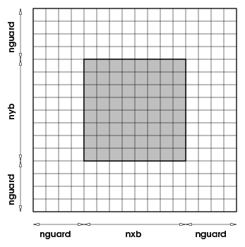
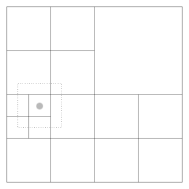

.. include:: defs.h

.. _`Chp:Grid Unit`:

Grid Unit
=========

.. _`Sec:GridIntroduction`:

Overview
--------

The ``Grid`` unit has four subunits: ``GridMain`` is responsible for
maintaining the Eulerian grid used to discretize the spatial dimensions
of a simulation; ``GridParticles`` manages the data movement related to
active, and Lagrangian tracer particles; ``GridBoundaryConditions``
handles the application of boundary conditions at the physical
boundaries of the domain; and ``GridSolvers`` provides services for
solving some types of partial differential equations on the grid. In the
Eulerian grid, discretization is achieved by dividing the computational
domain into one or more sub-domains or blocks and using these blocks as
the primary computational entity visible to the physics units. A block
contains a number of computational cells (``nxb`` in the
:math:`x`-direction, ``nyb`` in the :math:`y`-direction, and ``nzb`` in
the :math:`z`-direction). A perimeter of guardcells of width ``nguard``
cells in each coordinate direction, surrounds each block of local data,
providing it with data from the neighboring blocks or with boundary
conditions, as shown in . Since the majority of physics solvers used in
|flashx| are explicit, a block with its surrounding guard cells becomes a
self-contained computational domain. Thus the physics units see and
operate on only one block at a time, and this abstraction is reflected
in their design.

Therefore any mesh package that can present a self contained block as a
computational domain to a client unit can be used with |flashx|. However,
such interchangeability of grid packages also requires a careful design
of the ``Grid`` API to make the underlying management of the discretized
grid completely transparent to outside units. The data structures for
physical variables, the spatial coordinates, and the management of the
grid are kept private to the ``Grid`` unit, and client units can access
them only through accessor functions. This strict protocol for data
management along with the use of blocks as computational entities
enables |flashx| to abstract the grid from physics solvers and
facilitates the ability of |flashx| to use multiple mesh packages.

.. container:: center

   |image|

Any unit in the code can retrieve all or part of a block of data from
the ``Grid`` unit along with the coordinates of corresponding cells; it
can then use this information for internal computations, and finally
return the modified data to the ``Grid`` unit. The ``Grid`` unit also
manages the parallelization of |flashx|. It consists of a suite of
subroutines which handle distribution of work to processors and guard
cell filling. When using an adaptive mesh, the Grid unit is also
responsible for refinement/derefinement and conservation of flux across
block boundaries.

|flashx| can interchangeably use either a **uniform** or **adaptive
grid** for most problems. Additionally, a new feature in |flashx| is an
option to replicate the mesh; that is processors are assumed to be
partitioned into groups, each group gets a copy of the entire domain
mesh. This feature is useful when it is possible to decompose the
computation based upon certain compute intensive tasks that apply across
the domain. One such example is radiation transfer with multigroup flux
limited diffusion where each group needs an implicit solve. Here the
state variable of the mesh are replicated on each group of processors,
while the groups are unique. Thus at the cost of some memory redundancy,
it becomes possible to compute a higher fidelity problem (see for an
example). Because of this feature, the parallel environment of the
simulation is now controlled by the Driver which differentiates between
global communicators and mesh communicators. The Grid unit queries the
Driver unit for mesh communicators. In all other respects this change is
transparent to the Grid unit. Mesh replication can be invoked through
the runtime parameter ``Driver/meshCopyCount``

The uniform grid supported in |flashx| discretizes the physical domain by
placing grid points at regular intervals defined by the geometry of the
problem. The grid configuration remains unchanged throughout the
simulation, and exactly one block is mapped per processor. An adaptive
grid changes the discretization over the course of the computation, and
several blocks can be mapped to each computational processor. Two AMR
packages are currently supported in |flashx| for providing adaptive grid
capbility. The block-structured oct-tree based AMR package, ``PARAMESH``
has been the work horse since the beginning of the code.

.. container:: flashtip

   The following two commands will create the same (identical)
   application: a simulation of a Sod shock tube in 3 dimensions with
   ``PARAMESH`` 4 managing the grid.

   .. container:: codeseg

      ./setup Sod -3d -auto

      ./setup Sod -3d -auto
      -unit=Grid/GridMain/paramesh/paramesh4/|paramesh|4.0

   However, if the command is changed to

   .. container:: codeseg

      ./setup Sod -3d -auto -unit=Grid/GridMain/UG

   the application is set up with a uniform grid instead. Additionally,
   because two different grids types are supported in |flashx|, the user
   must match up the correct ``IO`` alternative implementation with the
   correct ``Grid`` alternative implementation. Please see for more
   details. Note that the ``setup`` script has capabilities to let the
   user set up shortcuts, such as “``+ugio``”, which makes sure that the
   appropriate branch of ``IO`` is included when the uniform grid is
   being used. Please see for more information. Also see for shortcuts
   useful for the Grid unit.

``GridMain`` Data Structures
----------------------------

The ``Grid`` unit is the most extensive infrastructure unit in the
|flashx| code, and it owns data that most other units wish to fetch and
modify. Since the data layout in this unit has implications on the
manageability and performance of the code, we describe it in some detail
here.

|flashx| can be run with a grid discretization that assumes cell-centered
data, face-centered data, or a combination of the two. |paramesh| and
Uniform Grid store physical data in multidimensional F90 arrays;
cell-centered variables in ``unk``, short for “unknowns”, and
face-centered variables in arrays called ``facevarx``, ``facevary``, and
``facevarz``, which contain the face-centered data along the :math:`x`,
:math:`y`, and :math:`z` dimensions, respectively. The cell-centered
array ``unk`` is dimensioned as ``array(NUNK_VARS,nxb,nyb,nzb,blocks)``,
where ``nxb``, ``nyb``, ``nzb`` are the spatial dimensions of a single
block, and *blocks* is the number of blocks per processor (``MAXBLOCKS``
for ``PARAMESH`` and 1 for UG). The face-centered arrays have one extra
data point along the dimension they are representing, for example
``facevarx`` is dimensioned as
``array(NFACE_VARS,nxb+1,nyb,nzb,blocks)``. Some or all of the actual
values dimensioning these arrays are determined at application setup
time. The number of variables and the value of ``MAXBLOCKS`` are always
determined at setup time. The spatial dimensions
``nxb``,\ ``nyb``,\ ``nzb`` can either be fixed at setup time, or they
may be determined at runtime. These two modes are referred to as
FIXEDBLOCKSIZE and NONFIXEDBLOCKSIZE.

All values determined at setup time are defined as constants in a file
``Simulation.h`` generated by the setup tool. This file contains all
application-specific global constants such as the number and naming of
physical variables, number and naming of fluxes and species, *etc.*; it
is described in detail in .

For cell-centered variables, the ``Grid`` unit also stores a **variable
type** that can be retrieved using the
``Simulation/Simulation_getVarnameType`` routine; see for the syntax and
meaning of the optional ``TYPE`` attribute that can be specified as part
of a ``VARIABLE`` definition read by the setup tool.

In addition to the primary physical variables, the ``Grid`` unit has
another set of data structures for storing auxiliary fluid variables.
This set of data structures provides a mechanism for storing such
variables whose spatial scope is the entire physical domain, but who do
not need to maintain their guard cells updated at all times. The data
structures in this set include: ``SCRATCHCENTERVAR``, which has the same
shape as the cell centered variables data structure; and
``SCRATCHFACEXVAR``, ``SCRATCHFACEYVAR`` and ``SCRATCHFACEZVAR``, which
have the same shape as the corresponding face centered variables data
structures. Early releases of |flashx|3 had ``SCRATCHVAR``, dimensioned
``array(NSCRATCH_GRID_VARS,nxb+1,nyb+1,nzb+1,blocks)``, as the only grid
scope scratch data structure. For reasons of backward compatibility, and
to maximize reusability of space, ``SCRATCHVAR`` continues to exist as a
supported data structure, though its use is deprecated. The
datastructures for face variables, though supported, are not used
anywhere in the released code base. The unsplit MHD solver
``StaggeredMesh`` discussed in gives an example of the use of some of
these data structures. It is important to note that there is no
guardcell filling for the scratch variables, and the values in the
scratch variables become invalid after a grid refinement step. While
users can define scratch variables to be written to the plotfiles, they
are not by default written to checkpoint files. The ``Grid`` unit also
stores the metadata necessary for work distribution, load balancing, and
other housekeeping activities. These activities are further discussed in
and , which describe individual implementations of the ``Grid`` unit.

.. _`Sec:computational domain`:

Computational Domain
--------------------

The size of the computational domain in physical units is specified at
runtime through the (``Grid/xmin``, ``Grid/xmax``) (``Grid/ymin``,
``Grid/ymax``) (``Grid/zmin``, ``Grid/zmax``) runtime parameters. When
working with curvilinear coordinates (see below in ), the extrema for
angle coordinates are specified in degrees. Internally all angles are
represented in radians, so angles are converted to radians at ``Grid``
initialization.

The physical domain is mapped into a computational domain at problem
initialization through routine ``Grid/Grid_initDomain`` in ``PARAMESH``
and ``Grid/Grid_init`` in ``UG``.When using the uniform grid ``UG``, the
mapping is easy: one block is created for each processor in the run,
which can be sized either at build time or runtime depending upon the
mode of UG use.  [1]_ Further description can be found in . When using
the AMR grid ``PARAMESH``, the mapping is non-trivial. The adaptive mesh
``gr_createDomain`` function creates an initial mesh of
``nblockx * nblocky * nblockz`` top level blocks, where
``Grid/nblockx``, ``Grid/nblocky``, and ``Grid/nblockz`` are runtime
parameters which default to 1. [2]_ The resolution of the computational
domain is usually very coarse and unsuitable for computation after the
initial mapping. The ``gr_expandDomain`` routine remedies the situation
by applying the refinement process to the initial domain until a
satisfactory level of resolution is reached everywhere in the domain.
This method of mapping the physical domain to computational domain is
effective because the resultant resolution in any section is related to
the demands of the initial conditions there.

.. _`Sec:BndryCond`:

Boundary Conditions
-------------------

Much of the |flashx| code within the ``Grid`` unit that deals with
implementing boundary conditions has been organized into a separate
subunit, ``GridBoundaryConditions``. Note that the following aspects are
still handled elsewhere:

-  Recognition of bounday condition names as strings (in runtime
   parameters) and constants (in the source code); these are defined in
   ``RuntimeParameters/RuntimeParameters_mapStrToInt`` and in
   ``constants.h``, respectively.

-  Handling of periodic boundary conditions; this is done within the
   underlying ``GridMain`` implementation. When using ``PARAMESH``, the
   subroutine ``gr_createDomain`` is responsible for setting the
   neighbors of top-level blocks (to either other top-level blocks or to
   external boundary conditions) at initialization, after
   ``Grid/Nblockx`` :math:`\times` ``Grid/Nblocky`` :math:`\times`
   ``Grid/Nblockz`` root blocks have been created. periodic
   (wrap-around) boundary conditions are initially configured in this
   routine as well. If periodic boundary conditions are set in the
   :math:`x`-direction, for instance, the first blocks in the
   :math:`x`-direction are set to have as their left-most neighbor the
   blocks that are last in the :math:`x`-direction, and *vice versa*.
   Thus, when the guard cell filling is performed, the periodic boundary
   conditions are automatically maintained.

-  Handling of user-defined boundary conditions; this should be
   implemented by code under the ``Simulation`` directory.

-  Low-level implementation and interfacing, such as are part of the
   ``PARAMESH`` code.

-  Behavior of particles at a domain boundary. This is based on the
   boundary types described below, but their handling is implemented in
   ``GridParticles``.

Although the ``GridBoundaryConditions`` subunit is included in a setup
by default, it can be excluded (if no ``Config`` file “``REQUIRES``” it)
by specifying ``-without-unit=Grid/GridBoundaryConditions``. This will
generally only make sense if all domain boundaries are to be treated as
periodic. (All relevant runtime parameters ``Grid/xl_boundary_type``
*etc.* need to be set to ``"periodic"`` in that case.)

Boundary Condition Types
~~~~~~~~~~~~~~~~~~~~~~~~

Boundary conditions are determined by the physical problem. Within
|flashx|, the parallel structure of blocks means that each processor
works independently. If a block is on a physical boundary, the guard
cells are filled by calculation since there are no neighboring blocks
from which to copy values. Boundaries are selected by setting runtime
parameters such as ``Grid/xl_boundary_type`` (for the ‘left’
:math:`X`–boundary) to one of the supported boundary types () in
``flash.par``. Even though the runtime parameters for specifying
boundary condition types are strings, the ``Grid`` unit understands them
as defined integer constants defined in the file ``constants.h``, which
contains all global constants for the code. The translation from the
string specified in “flash.par” to the constant understood by the
``Grid`` unit is done by the routine
``RuntimeParameters/RuntimeParameters_mapStrToInt``.

.. container:: center

   .. container::
      :name: Tab:Boundaries

      .. table::  Hydrodynamical boundary conditions supported by
      |flashx|. Boundary type *ab* may be replaced with
      :math:`a`\ ={x,y,z} for direction and :math:`b`\ ={l,r} for
      left/right edge. All boundary types listed except the last
      (``user``) have an implementation in ``GridBoundaryConditions``.

         +----------------------------------+----------------------------------+
         | ***ab*\ \_boundary_type**        | **Description**                  |
         +==================================+==================================+
         | ``periodic``                     | Periodic (‘wrap-around’)         |
         +----------------------------------+----------------------------------+
         | ``reflect``,\ ``reflecting``     | Non-penetrating boundaries;      |
         |                                  | plane symmetry, the normal       |
         |                                  | vector components change sign    |
         +----------------------------------+----------------------------------+
         | ``outflow``                      | Zero-gradient boundary           |
         |                                  | conditions; allows shocks to     |
         |                                  | leave the domain                 |
         +----------------------------------+----------------------------------+
         | ``diode``                        | like outflow, but fluid          |
         |                                  | velocities are never allowed to  |
         |                                  | let matter flow into the domain: |
         |                                  | normal velocity components are   |
         |                                  | forced to zero in guard cells if |
         |                                  | necessary                        |
         +----------------------------------+----------------------------------+
         | ``axisymmetric``                 | like ``reflect``, but both       |
         |                                  | normal and toroidal vector       |
         |                                  | components change sign.          |
         |                                  | Typically used with cylindrical  |
         |                                  | geometry (R-Z) for the Z         |
         |                                  | symmetry axis.                   |
         +----------------------------------+----------------------------------+
         | ``eqtsymmetric``                 | like reflect for velocities but  |
         |                                  | the magnetic field components,   |
         |                                  | poloidal and toroidal, change    |
         |                                  | sign. The sign of the normal     |
         |                                  | magnetic field component remains |
         |                                  | the same. Typically used with    |
         |                                  | cylindrical geometry (R-Z) for   |
         |                                  | the R axis to emulate equatorial |
         |                                  | symmetry.                        |
         +----------------------------------+----------------------------------+
         | ``hydrostatic-f2``               | Hydrostatic boundary handling as |
         |                                  | in |flashx|. See remark in text.  |
         +----------------------------------+----------------------------------+
         | ``hydrostatic-f2+nvrefl``,       | Variants of ``hydrostatic-f2``,  |
         | ``hydrostatic-f2+nvout``,        | where the **n**\ ormal           |
         | ``hydrostatic-f2+nvdiode``       | **v**\ elocity is handled        |
         |                                  | specially in various ways,       |
         |                                  | analogous to ``reflect``,        |
         |                                  | ``outflow``, and ``diode``       |
         |                                  | boundary conditions,             |
         |                                  | respectively. See remark in      |
         |                                  | text.                            |
         +----------------------------------+----------------------------------+
         | ``user-defined`` or ``user``     | The user must implement the      |
         |                                  | desired boundary behavior; see   |
         |                                  | text.                            |
         +----------------------------------+----------------------------------+

To use any of the ``hydrostatic-f2*`` boundary conditions, the setup
must include ``Grid/GridBoundaryConditions/Flash2HSE``. This must
usually be explicitly requested, for example with a line

.. container:: codeseg

   REQUIRES Grid/GridBoundaryConditions/Flash2HSE

in the simulation directory’s ``Config`` file.

Note that the ``Gravity/grav_boundary_type`` runtime parameter is used
by some implementations of the ``Gravity`` unit to define the type of
boundary for solving a self-gravity (Poisson) problem; see
``physics/Gravity/Gravity_init``. This runtime parameter is separate
from the ***ab*\ \_boundary_type** ones interpreted by
``GridBoundaryConditions``, and its recognized values are not the same
(although there is some overlap).

.. container:: center

   .. container::
      :name: Tab:RecognizedBoundaries

      .. table:: Additional boundary condition types recognized by
      |flashx|. Boundary type *ab* may be replaced with a={x,y,z} for
      direction and b={l,r} for left/right edge. These boundary types
      are either reserved for implementation by users and/or future
      |flashx| versions for a specific purpose (as indicate by the
      remarks), or are for special uses within the ``Grid`` unit.

         +----------------------+----------------------+----------------------+
         | ***ab                | **Constant**         | **Remark**           |
         | *\ \_boundary_type** |                      |                      |
         +======================+======================+======================+
         | ``isolated``         | —                    | used by Gravity only |
         |                      |                      | for                  |
         |                      |                      | ``Gravity/           |
         |                      |                      | grav_boundary_type`` |
         +----------------------+----------------------+----------------------+
         | —                    | ``DIRICHLET``        | used for multigrid   |
         |                      |                      | solver               |
         +----------------------+----------------------+----------------------+
         | —                    | ``GRI                | for use by multigrid |
         |                      | DBC_MG_EXTRAPOLATE`` | solver               |
         +----------------------+----------------------+----------------------+
         | —                    | ``PNEUMANN``         | (for use by          |
         |                      |                      | multigrid solver)    |
         +----------------------+----------------------+----------------------+
         | ``hydrostatic``      | ``HYDROSTATIC``      | Hydrostatic, other   |
         |                      |                      | implementation than  |
         |                      |                      | |flashx|              |
         +----------------------+----------------------+----------------------+
         | ``                   | ``                   | Hydrostatic variant, |
         | hydrostatic+nvrefl`` | HYDROSTATIC_NVREFL`` | other impl.  than    |
         |                      |                      | |flashx|              |
         +----------------------+----------------------+----------------------+
         | `                    | `                    | Hydrostatic variant, |
         | `hydrostatic+nvout`` | `HYDROSTATIC_NVOUT`` | other impl.  than    |
         |                      |                      | |flashx|              |
         +----------------------+----------------------+----------------------+
         | ``h                  | ``H                  | Hydrostatic variant, |
         | ydrostatic+nvdiode`` | YDROSTATIC_NVDIODE`` | other impl.  than    |
         |                      |                      | |flashx|              |
         +----------------------+----------------------+----------------------+

Boundary Conditions at Obstacles
~~~~~~~~~~~~~~~~~~~~~~~~~~~~~~~~

The initial coarse grid of root blocks can be modified by removing
certain blocks. This is done by providing a non-trivial implementation
of ``Simulation/Simulation_defineDomain``. Effectively this creates
additional domain boundaries at the interface between blocks removed and
regions still included. All boundary conditions other than ``periodic``
are possible at these additional boundaries, and are handled there in
the same way as on external domain boundaries. This feature is only
available with ``PARAMESH``. See the documentation and example in
``Simulation/Simulation_defineDomain`` for more details and some
caveats.

Implementing Boundary Conditions
~~~~~~~~~~~~~~~~~~~~~~~~~~~~~~~~

Users may need to implement boundary conditions beyond those provided
with |flashx|, and the ``GridBoundaryConditions`` subunit provides
several ways to achieve this. Users can provide an implementation for
the ``user`` boundary type; or can provide or override an implementation
for one of the other recognized types.

The simple boundary condition types ``reflect``, ``outflow``, ``diode``
are implemented in the ``Grid/Grid_bcApplyToRegion``\ ``.F90`` file in
``Grid/GridBoundaryConditions``. A users can add or modify the handling
of some boundary condition types in a version of this file in the
simulation directory, which overrides the regular version. There is,
however, also the interface ``Grid/Grid_bcApplyToRegionSpecialized``
which by default is only provided as a stub and is explicitly intended
to be implemented by users. A ``Grid/Grid_bcApplyToRegionSpecialized``
implementation gets called before ``Grid/Grid_bcApplyToRegion`` and can
decide to either handle a specific combination of boundary condition
type, direction, grid data structure, *etc.*, or leave it to
``Grid/Grid_bcApplyToRegion``. These calls operate on a region of one
block’s cells at a time. |flashx| will pass additional information beyond
that needed for handling simple boundary conditions to
``Grid/Grid_bcApplyToRegionSpecialized``, in particular a block handle
through which an implementation can retrieve coordinate information and
access other information associated with a block and its cells.

The ``GridBoundaryConditions`` subunit also provides a simpler kind of
interface if one includes ``Grid/GridBoundaryConditions/OneRow`` in the
setup. When using this style of interface, users can implement guard
cell filling one row at a time. |flashx| passes to the implementation one
row of cells at a time, some of which are interior cells while the
others represent guard cells outside the boundary that are to be
modified in the call. A row here means a contiguous set of cells along a
line perpendicular to the boundary surface. There are two versions of
this interface: ``Grid/Grid_applyBCEdge`` is given only one fluid
variable at a time, but can also handle data structures other than
``unk``; whereas ``Grid/Grid_applyBCEdgeAllUnkVars`` handles all
variables of ``unk`` along a row in one call. Cell coordinate
information is included in the call arguments. |flashx| invokes these
functions through an implementation of
``Grid/Grid_bcApplyToRegionSpecialized`` in
``Grid/GridBoundaryConditions/OneRow`` which acts as a wrapper.
``GridBoundaryConditions/OneRow`` also provides a default implementation
of ``Grid/Grid_applyBCEdge`` (which implements the simple boundary
conditions) and ``Grid/Grid_applyBCEdgeAllUnkVars`` (which calls
``Grid_applyBCEdge``) each. Another implementation of
``Grid/Grid_applyBCEdgeAllUnkVars`` can be found in
``GridBoundaryConditions/OneRow/Flash2HSE``, this one calls
``Grid_applyBCEdge`` or, for |flashx|-type hydrostatic boundaries, the
code for handling them. These can be used as templates for overriding
implementations under ``Simulation``. It is not recommended to try to
mix both ``Grid_bcApplyToRegion*``-style and ``Grid_applyBCEdge*``-style
overriding implementations in a simulation directory, since this could
become confusing.

Note that in all of these cases, *i.e.*, whether boundary guard cell
filling for a boundary type is implemented in
``Grid/Grid_bcApplyToRegion``, ``Grid/Grid_bcApplyToRegionSpecialized``,
``Grid/Grid_applyBCEdge``, or ``Grid/Grid_applyBCEdgeAllUnkVars``, the
implementation does not fill guard cells in permanent data storage (the
``unk`` array and similar data structures) directly, but operates on
buffers. |flashx| fills some parts of the buffers with current values for
interior cells before the call, and copies updated guardcell data from
some (other) parts of the buffers back into ``unk`` (or similar) storage
after the handling routine returns.

All calls to handlers for boundary conditions are for one face in a
given dimension at a time. Thus for each of the ``IAXIS``, ``JAXIS``,
and ``KAXIS`` dimensions there can be up to two series of calls, once
for the left, *i.e.*, “``LOW``,” and once for the right, *i.e.*,
“``HIGH``,” face. ``PARAMESH`` 4 makes additional calls for filling
guard cells in edge and corner regions of blocks, these calls result in
additional ``Grid_bcApplyToRegion*`` invocations for those cells that
lie in diagonal directions from the block interior.

The boundary condition handling interfaces described so far can be
implemented (and will be used!) independent of the ``Grid``
implementation chosen. At a lower level, the various implementations of
``GridMain`` have different ways of requesting that boundary guard cells
be filled. The ``GridBoundaryConditions`` subunit collaborates with
``GridMain`` implementations to provide to user code uniform interfaces
that are agnostic of lower-level details. However, it is also possible —
but not recommended — for users to replace a routine that is located
deeper in the ``Grid`` unit. For ``PARAMESH`` 4, the most relevant
routine is ``amr_1blk_bcset.F90``, for ``PARAMESH`` 2 it is
``tot_bnd.F90``, and for uniform grid ``UG`` it is
``gr_bcApplyToAllBlks.F90``.

Additional Concerns with ``PARAMESH`` 4
^^^^^^^^^^^^^^^^^^^^^^^^^^^^^^^^^^^^^^^

Boundary condition handling has become significantly more complex in
|flashx|. In part this is so because ``PARAMESH`` 4 imposes requirements
on guard cell filling code that do not exist in the other ``GridMain``
implementations:

#. In other ``Grid`` implementations, filling of domain boundary guard
   cells is under control of the “user” (in this context, the user of
   the grid implementation, *i.e.*, |flashx|): These cells can be filled
   for all blocks at a time that is predictable to the user code, as a
   standard part of handling ``Grid/Grid_fillGuardCells``, only. With
   ``PARAMESH`` 4, the user-provided ``amr_1blk_bcset`` routine can be
   called from within the depths of ``PARAMESH`` on individual blocks
   (and cell regions, see below) during guard cell filling and at other
   times when the user has called a ``PARAMESH`` routine. It is not easy
   to predict when and in which sequence this will happen.

#. ``PARAMESH`` 4 does not want all boundary guard cells filled in one
   call, but requests individual regions in various calls.

#. ``PARAMESH`` 4 does not let the user routine ``amr_1blk_bcset``
   operate on permanent storage (``unk`` *etc.*) directly, but on
   (regions of) one-block buffers.

#. ``PARAMESH`` 4 occasionally invokes ``amr_1blk_bcset`` to operate on
   regions of a block that belongs to a remote processor (and for which
   data has been cached locally). Such block data is not associated with
   a valid local ``blockID``, making it more complicated for user code
   to retrieve metadata that may be needed to implement the desired
   boundary handling.

Some consequences of this for |flashx| users:

-  User code that implements boundary conditions for the grid inherits
   the requirement that it must be ready to be called at various times
   (when certain ``Grid`` routines are called).

-  User code that implements boundary conditions for the grid inherits
   the requirement that it must operate on a region of the cells of a
   block, where the region is specified by the caller.

-  Such user code must not assume that it operates on permanent data (in
   ``unk`` *etc.*). Rather, it must be prepared to fill guardcells for a
   block-shaped buffer that may or may not end up being copied back to
   permanent storage.

   User code also is not allowed to make certain ``PARAMESH`` 4 calls
   while a call to ``amr_1blk_bcset`` is active, namely those that would
   modify the same one-block buffers that the current call is working
   on.

-  The user code must not assume that the block data it is acting on
   belongs to a local block. The data may not have a valid ``blockID``.
   The code will be passed a “block hande” which can be used in some
   ways, but not all, like a valid ``blockID``.

.. _`Sec:Grid UG`:

Uniform Grid
------------

The Uniform Grid has the same resolution in all the blocks throughout
the domain, and each processor has exactly one block. The uniform grid
can operate in either of two modes: fixed block size (FIXEDBLOCKSIZE)
mode, and non-fixed block size (NONFIXEDBLOCKSIZE) mode. The default
fixed block size grid is statically defined at compile time and can
therefore take advantage of compile-time optimizations. The non-fixed
block size version uses dynamic memory allocation of grid variables.

FIXEDBLOCKSIZE Mode
~~~~~~~~~~~~~~~~~~~

``FIXEDBLOCKSIZE`` mode, also called static mode, is the default for the
uniform grid. In this mode, the block size is specified at compile time
as ``NXB``\ :math:`\times`\ ``NYB``\ :math:`\times`\ ``NZB``. These
variables default to :math:`8` if the dimension is defined and :math:`1`
otherwise – *e.g.* for a two-dimensional simulation, the defaults are
``NXB``\ :math:`=8`, ``NYB``\ :math:`=8`, ``NZb``\ :math:`=1`. To change
the static dimensions, specify the desired values on the command line of
the ``setup`` script; for example

.. container:: codeseg

   ./setup Sod -auto -3d -nxb=12 -nyb=12 -nzb=4 +ug

The distribution of processors along the three dimensions is given at
run time as :math:`iprocs\times jprocs\times kprocs` with the constraint
that this product must be equal to the number of processors that the
simulation is using. The global domain size in terms of number of grid
points is :math:`{\tt NXB}*iprocs \times {\tt NYB}*jprocs \times 
{\tt NZB}*kprocs`. For example, if :math:`iprocs=jprocs=4` and
:math:`kprocs=1`, the execution command should specify :math:`np=16`
processors.

.. container:: codeseg

   mpirun -np 16 flash3

When working in static mode, the simulation is constrained to run on the
same number of processors when restarting, since any different
configuration of processors would change the domain size.

At Grid initialization time, the domain is created and the communication
machinery is also generated. This initialization includes MPI
communicators and datatypes for directional guardcell exchanges. If we
view processors as arranged in a three-dimensional processor grid, then
a row of processors along each dimension becomes a part of the same
communicator. We also define MPI datatypes for each of these
communicators, which describe the layout of the block on the processor
to MPI. The communicators and datatypes, once generated, persist for the
entire run of the application. Thus the ``MPI_SEND/RECV`` function with
specific communicator and its corresponding datatype is able to carry
out all data exchange for guardcell fill in the selected direction in a
single step.

Since all blocks exist at the same resolution in the Uniform Grid, there
is no need for interpolation while filling the guardcells. Simple
exchange of correct data between processors, and the application of
boundary conditions where needed is sufficient. The guard cells along
the face of a block are filled with the layers of the interior cells of
the block on the neighboring processor if that face is shared with
another block, or calculated based upon the boundary conditions if the
face is on the physical domain boundary. Also, because there are no
jumps in refinement in the Uniform Grid, the flux conservation step
across processor boundaries is unnecessary. For correct functioning of
the Uniform Grid in |flashx|, this conservation step should be explicitly
turned off with a runtime parameter ``Grid/flux_correct`` which controls
whether or not to run the flux conservation step in the PPM
Hydrodynamics implementation. AMR sets it by default to true, while UG
sets it to false. Users should exercise care if they wish to override
the defaults via their “``flash.par``” file.

.. _`Sec:NONFIXEDBLOCKSIZE`:

NONFIXEDBLOCKSIZE mode
~~~~~~~~~~~~~~~~~~~~~~

Up ot version 2, |flashx| always ran in a mode where all blocks have
exactly the same number of grid points in exactly the same shape, and
these were fixed at compile time. |flashx| was limited to use the fixed
block size mode described above. With |flashx| this constraint was
eliminated through an option at setup time. The two main reasons for
this development were: one, to allow a uniform grid based simulation to
be able to restart with different number of processors, and two, to open
up the possibility of using other AMR packages with |flashx|. Patch-based
packages typically have different-sized block configurations at
different times. This mode, called the “NONFIXEDBLOCKSIZE” mode, can
currently be selected for use with Uniform Grid. To run an application
in “NONFIXEDBLOCKSIZE” mode the “``-nofbs``” option must be used when
invoking the setup tool; see for more information. For example:

.. container:: codeseg

   ./setup Sod -3d -auto -nofbs

Note that ``NONFIXEDBLOCKSIZE`` mode requires the use of its own IO
implementation, and a convenient shortcut has been provided to ensure
that this mode is used as in the example below:

.. container:: codeseg

   ./setup Sod -3d -auto +nofbs

In this mode, the blocksize in UG is determined at execution from
runtime parameters ``Grid/iGridSize``, ``Grid/jGridSize`` and
``Grid/kGridSize``. These parameters specify the global number of grid
points in the computational domain along each dimension. The blocksize
then is
:math:`(iGridSize/iprocs)\times(jGridSize/jprocs)\times(kGridSize/kprocs)`.

Unlike ``FIXEDBLOCKSIZE`` mode, where memory is allocated at compile
time, in the ``NONFIXEDBLOCKSIZE`` mode allocation is dynamic. The
global data structures are allocated when the simulation initializes and
deallocated when the simulation finalizes, whereas the local scratch
space is allocated and deallocated every time a unit is invoked in the
simulation. Clearly there is a trade-off between flexibility and
performance as the ``NONFIXEDBLOCKSIZE`` mode typically runs about
10-15% slower. We support both to give choice to the users. The amount
of memory consumed by the Grid data structure of the Uniform Grid is
:math:`{\tt nvar} \times (2*{\tt nguard}+{\tt nxb}) \times
(2*{\tt nguard}+{\tt nyb})\times(2*{\tt nguard}+{\tt nzb})` irrespective
of the mode. Note that this is not the total amount of memory used by
the code, since fluxes, temporary variables, coordinate information and
scratch space also consume a large amount of memory.

The example shown below gives two possible ways to define parameters in
``flash.par`` for a 3d problem of global domain size :math:`64 \times
64 \times 64`, being run on 8 processors.

.. container:: codeseg

   iprocs = 2 jprocs = 2 kprocs = 2 iGridSize = 64 jGridSize = 64
   kGridSize = 64

This specification will result in each processor getting a block of size
:math:`32 \times 32 \times 32`. Now consider the following specification
for the number of processors along each dimension, keeping the global
domain size the same.

.. container:: codeseg

   iprocs = 4 jprocs = 2 kprocs = 1

In this case, each processor will now have blocks of size
:math:`16 \times 32 \times 64`.

.. _`Sec:Grid AMR`:

Adaptive Mesh Refinement (AMR) Grid with |paramesh|
-------------------------------------------------

The default package in |flashx| is ``PARAMESH`` (MacNeice *et al.* 1999)
for implementing the adaptive mesh refinement (AMR) grid. ``PARAMESH``
uses a block-structured adaptive mesh refinement scheme similar to
others in the literature (*e.g.*, Parashar 1999; Berger & Oliger 1984;
Berger & Colella 1989; DeZeeuw & Powell 1993). It also shares ideas with
schemes which refine on an individual cell basis (Khokhlov 1997). In
block-structured AMR, the fundamental data structure is a block of cells
arranged in a logically Cartesian fashion. “Logically Cartesian” implies
that each cell can be specified using a block identifier (processor
number and local block number) and a coordinate triple :math:`(i,j,k)`,
where :math:`i=1\ldots{\tt nxb}`, :math:`j=1\ldots{\tt nyb}`, and
:math:`k=1\ldots{\tt nzb}` refer to the :math:`x`-, :math:`y`-, and
:math:`z`-directions, respectively. It does not require a physically
rectangular coordinate system; for example a spherical grid can be
indexed in this same manner.

The complete computational grid consists of a collection of blocks with
different physical cell sizes, which are related to each other in a
hierarchical fashion using a tree data structure. The blocks at the root
of the tree have the largest cells, while their children have smaller
cells and are said to be refined. Three rules govern the establishment
of refined child blocks in ``PARAMESH``. First, a refined child block
must be one-half as large as its parent block in each spatial dimension.
Second, a block’s children must be nested; *i.e.*, the child blocks must
fit within their parent block and cannot overlap one another, and the
complete set of children of a block must fill its volume. Thus, in
:math:`d` dimensions a given block has either zero or :math:`2^d`
children. Third, blocks which share a common border may not differ from
each other by more than one level of refinement.

A simple two-dimensional domain is shown in , illustrating the rules
above. Each block contains
:math:`{\tt nxb}\times{\tt nyb}\times{\tt nzb}` interior cells and a set
of guard cells. The guard cells contain boundary information needed to
update the interior cells. These can be obtained from physically
neighboring blocks, externally specified boundary conditions, or both.

.. container:: center

   |image1|

The number of guard cells needed depends upon the interpolation schemes
and the differencing stencils used by the various physics units (usually
hydrodynamics). For the explicit PPM algorithm distributed with |flashx|,
four guard cells are needed in each direction, as illustrated in . The
blocksize while using the adaptive grid is fixed at compile time,
resulting in static memory allocation. The total number of blocks a
processor can manage is determined by ``MAXBLOCKS`` which can be
overridden at setup time with the ``setup …-maxblocks=#`` argument. The
amount of memory consumed by the Grid data structure of code when
running with ``PARAMESH`` is :math:`{\tt NUNK\_VARS} \times
(2*{\tt nguard}+{\tt nxb}) \times
(2*{\tt nguard}+{\tt nyb}) \times
(2*{\tt nguard}+{\tt nzb}) \times {\tt MAXBLOCKS}`. ``PARAMESH`` also
needs memory to store its tree data structure for adaptive mesh
management, over and above what is already mentioned with Uniform Grid.
As the levels of refinement increase, the size of the tree also grows.

``PARAMESH`` handles the filling of guard cells with information from
other blocks or, at the boundaries of the physical domain, from an
external boundary routine (see ). If a block’s neighbor exists and has
the same level of refinement, ``PARAMESH`` fills the corresponding guard
cells using a direct copy from the neighbor’s interior cells. If the
neighbor has a different level of refinement, the data from the
neighbor’s cells must be adjusted by either interpolation (to a finer
level of resolution) or averaging (to a coarser level) —see below for
more information. If the block and its neighbor are stored in the memory
of different processors, ``PARAMESH`` handles the appropriate parallel
communications (blocks are never split between processors). The filling
of guard cells is a global operation that is triggered by calling
``Grid/Grid_fillGuardCells``.

Grid Interpolation is also used when filling the blocks of children
newly created in the course of automatic refinement. This happens during
``Grid/Grid_updateRefinement`` processing. Averaging is also used to
regularly update the solution data in at least one level of parent
blocks in the oct-tree. This ensures that after leaf nodes are removed
during automatic refinement processing (in regions of the domain where
the mesh is becoming coarser), the new leaf nodes automatically have
valid data. This averaging happens as an initial step in
``Grid/Grid_fillGuardCells`` processing.

``PARAMESH`` also enforces flux conservation at jumps in refinement, as
described by Berger and Colella (1989). At jumps in refinement, the
fluxes of mass, momentum, energy (total and internal), and species
density in the fine cells across boundary cell faces are summed and
passed to their parent. The parent’s neighboring cell will be at the
same level of refinement as the summed flux cell because ``PARAMESH``
limits the jumps in refinement to one level between blocks. The flux in
the parent that was computed by the more accurate fine cells is taken as
the correct flux through the interface and is passed to the
corresponding coarse face on the neighboring block (see ). The summing
allows a geometrical weighting to be implemented for non-Cartesian
geometries, which ensures that the proper volume-corrected flux is
computed.

.. container:: center

   .. figure:: Grid_flux_cons.png
      :alt: Flux conservation at a jump in refinement. The fluxes in the
      fine cells are added and replace the coarse cell flux (F).
      :name: Fig:flux_conservation_fig
      :height: 2.5in

      Flux conservation at a jump in refinement. The fluxes in the fine
      cells are added and replace the coarse cell flux (F).

.. _`Sec:amr data struct`:

Additional Data Structures
~~~~~~~~~~~~~~~~~~~~~~~~~~

``PARAMESH`` maintains much additional information about the mesh. In
particular, oct-tree related information is kept in various arrays which
are declared in a F90 module called “``tree``”. It includes the physical
coordinate of a block’s center, its physical size, level of refinement,
and much more. These data structures also acts as temporary storage
while updating refinement in the grid and moving the blocks. This
metadata should in general not be accessed directly by application code.
The ``Grid`` API contains subroutines for accessing the most important
pars of this metadata on a block by block basis, like
``Grid/Grid_getBlkBoundBox``, ``Grid/Grid_getBlkCenterCoords``,
``Grid/Grid_getBlkPhysicalSize``, ``Grid/Grid_getBlkRefineLevel``, and
``Grid/Grid_getBlkType``.

|flashx| has its own ``oneBlock`` data structure that stores block
specific information. This data structure keeps the physical coordinates
of each cell in the block. For each dimension, the coordinates are
stored for the ``LEFT_EDGE``, the ``RIGHT_EDGE`` and the center of the
cell. The coordinates are determined from “*cornerID*” which is also a
part of this data structure.

The concept of ``cornerID`` was introduced in |flashx|; it serves three
purposes. First, it creates a unique global identity for every cell that
can come into existence at any time in the course of the simulation.
Second, it can prevent machine precision error from creeping into the
spatial coordinates calculation. Finally, it can help pinpoint the
location of a block within the oct-tree of ``PARAMESH``. Another useful
integer variable is the concept of a *stride*. A stride indicates the
spacing factor between one cell and the cell directly to its right when
calculating the cornerID. At the maximum refinement level, the stride is
:math:`1`, at the next higher level it is :math:`2`, and so on. Two
consecutive cells at refinement level :math:`n` are numbered with a
stride of :math:`2^{lrefine\_max-n}` where :math:`1 \le n \le
lrefine\_max`.

The routine ``Grid/Grid_getBlkCornerID`` provides a convenient way for
the user to retrieve the location of a block or cell. A usage example is
provided in the documentation for that routine. The user should retrieve
accurate physical and grid coordinates by calling the routines
``Grid/Grid_getBlkCornerID``, ``Grid/Grid_getCellCoords``,
``Grid/Grid_getBlkCenterCoords`` and ``Grid/Grid_getBlkPhysicalSize``,
instead of calculating their own from local block information, since
they take advantage of the ``cornerID`` scheme, and therefore avoid the
possibility of introducing machine precision induced numerical drift in
the calculations.

.. _`Sec:gridinterp`:

Grid Interpolation (and Averaging)
~~~~~~~~~~~~~~~~~~~~~~~~~~~~~~~~~~

The adaptive grid requires data **interpolation** or **averaging** when
the refinement level (*i.e.*, mesh resolution) changes in space or in
time.  [3]_ If during guardcell filling a block’s neighbor has a coarser
level of refinement, the neighbor’s cells are used to **interpolate**
guard cell values to the cells of the finer block. Interpolation is also
used when filling the blocks of children newly created in the course of
automatic refinement. Data **averaging** is used to adapt data in the
opposite direction, *i.e.*, from fine to coarse.

In the AMR context, the term **prolongation** is used to refer to data
interpolation (because it is used when the tree of blocks grows longer).
Similarly, the term **restriction** is used to refer to fine-to-coarse
data averaging.

The algorithm used for restriction is straightforward (equal-weight)
averaging in Cartesian coordinates, but has to take cell volume factors
into account for curvilinear coordinates; see .

``PARAMESH`` supports various interpolation schemes, to which
user-specified interpolation schemes can be added. |flashx| currently
allows to choose between two interpolation schemes:

#. monotonic

#. native

The choice is made at ``setup`` time, see .

The versions of ``PARAMESH`` supplied with |flashx| supply their own
default interpolation scheme, which is used when |flashx| is configured
with the ``-gridinterpolation=native`` ``setup`` option (see ). The
default schemes are only appropriate for Cartesian coordinates. If
|flashx| is configured with curvilinear support, an alternative scheme
(appropriate for all supported geometries) is compiled in. This
so-called “**monotonic**” interpolation attempts to ensure that
interpolation does not introduce small-scale non-monotonicity in the
data. The order of “monotonic” interpolation can be chosen with the
``Grid/interpol_order`` runtime parameter. See for some more details on
prolongation for curvilinear coordinates. At setup time, monotonic
interpolation is the default interpolation used.

.. _`Sec:InterpMassSpecific`:

Interpolation for mass-specific solution variables
^^^^^^^^^^^^^^^^^^^^^^^^^^^^^^^^^^^^^^^^^^^^^^^^^^

To accurately preserve the total amount of conserved quantities, the
interpolation routines have to be applied to solution data in
**conserved**, *i.e.*, volume-specific, form. However, many variables
are usually stored in the ``unk`` array in mass-specific form, *e.g.*,
specific internal and total energies, velocities, and mass fractions.
See for how to use the optional ``TYPE`` attribute in a ``Config``
file’s ``VARIABLE`` definitions to inform the ``Grid`` unit which
variables are considered mass-specific.

|flashx| provides three ways to deal with this:

#. Do nothing—*i.e.*, assume that ignoring the difference between
   mass-specific and conserved form is a reasonable approximation.
   Depending on the smoothness of solutions in regions where refinement,
   derefinement, and jumps in refinement level occur, this assumption
   may be acceptable. This behavior can be forced by setting the
   ``Grid/convertToConsvdInMeshInterp`` runtime parameter to ``.false.``

#. Convert mass-specific variables to conserved form *in all blocks
   throughout the physical domain* before invoking a ``Grid`` function
   that may result in some data interpolation or restriction
   (refinement, derefinement, guardcell filling); and convert back after
   these functions return. Conversion is done by cell-by-cell
   multiplication with the density (*i.e.*, the value of the “``dens``”
   variable, which should be declared as

   .. container:: codeseg

      VARIABLE dens TYPE: PER_VOLUME

   in a ``Config`` file).

   This behavior is available in both ``PARAMESH`` 2 and ``PARAMESH`` 4.
   It is enabled by setting the ``Grid/convertToConsvdForMeshCalls``
   runtime parameter and corresponds roughly to |flashx| with
   ``conserved_var`` enabled.

#. Convert mass-specific variables to conserved form only where and when
   necessary, from the ``Grid`` user’s point of view *as part of data
   interpolation*. Again, conversion is done by cell-by-cell
   multiplication with the value of density. In the actual
   implementation of this approach, the conversion and back-conversion
   operations are closely bracketing the interpolation (or restriction)
   calls. The implementation avoids spurious back-and-forth conversions
   (*i.e.*, repeated successive multiplications and divisions of data by
   the density) in blocks that should not be modified by interpolation
   or restriction.

   This behavior is available only for ``PARAMESH`` 4. As of |flashx|,
   this is the default behavior whenever available. It can be enabled
   explicitly (only necessary in setups that change the default) by
   setting the ``Grid/convertToConsvdInMeshInterp`` runtime parameter.

.. _`Sec: refinement`:

Refinement
~~~~~~~~~~

Refinement Criteria
^^^^^^^^^^^^^^^^^^^

The refinement criterion used by ``PARAMESH`` is adapted from Löhner
(1987). Löhner’s error estimator was originally developed for finite
element applications and has the advantage that it uses a mostly local
calculation. Furthermore, the estimator is dimensionless and can be
applied with complete generality to any of the field variables of the
simulation or any combination of them.

.. container:: flashtip

   |flashx| does not define any refinement variables by default.
   Therefore simulations using AMR have to make the appropriate runtime
   parameter definitions in ``flash.par``, or in the simulation’s
   ``Config`` file. If this is not done, the program generates a warning
   at startup, and no automatic refinement will be performed. The
   mistake of not specifying refinement variables is thus easily
   detected. To define a refinement variable, use ``Grid/refine_var_#``
   (where ``#`` stands for a number from 1 to 4) in the ``flash.par``
   file.

Löhner’s estimator is a modified second derivative, normalized by the
average of the gradient over one computational cell. In one dimension on
a uniform mesh, it is given by

.. math::

   E_{i} = { \frac{ \mid u_{i+1} - 2u_{i} + u_{i-1} \mid}
   %          \over
            { \mid u_{i+1} - u_{i} \mid + \mid u_{i} - u_{i-1} \mid +
                 \epsilon [ \mid u_{i+1} \mid + 2 \mid  u_{i} \mid +
                             \mid u_{i-1} \mid ] }\ } ,
   %E_{i} = { \mid u_{i+1} - 2u_{i} + u_{i-1} \mid
   %          \over  % warning about Foreign over from amsmath
   %          \mid u_{i+1} - u_{i} \mid + \mid u_{i} - u_{i-1} \mid +
   %              \epsilon [ \mid u_{i+1} \mid + 2 \mid  u_{i} \mid +
   %                          \mid u_{i-1} \mid ] }\ ,

where :math:`u_i` is the refinement test variable’s value in the
:math:`i`\ th cell. The last term in the denominator of this expression
acts as a filter, preventing refinement of small ripples, where
:math:`\epsilon` should be a small constant.

When extending this criterion to multidimensions, all cross derivatives
are computed, and the following generalization of the above expression
is used

.. math::

   E_{i_1i_2i_3} = \left\{
               {\displaystyle
   %            \sum_{pq}\left({\partial^2 u\over\partial x_p\partial x_q}
               \sum_{pq}\left({ \frac{\partial^2 u}{\partial x_p\partial x_q}}
                              \Delta x_p\Delta x_q\right)^2
               }
               \over
               {\displaystyle
               \sum_{pq}\left[\left(
                            \left|{\partial u\over\partial x_p}\right|_{i_p+1/2}
                            + \left|{\partial u\over\partial x_p}\right|_{i_p-1/2}
                              \right)\Delta x_p
                              + \epsilon{\partial^2 |u|\over
                              \partial x_p\partial x_q}
                              \Delta x_p\Delta x_q
                        \right]^2
               }
             \right\}^{1/2},

where the sums are carried out over coordinate directions, and where,
unless otherwise noted, partial derivatives are evaluated at the center
of the :math:`i_1i_2i_3`-th cell.

The estimator actually used in |flashx|\ ’s default refinement criterion
is a modification of the above, as follows:

.. math::

   E_{i} = { \mid u_{i+2} - 2u_{i} + u_{i-2} \mid
             \over
             \mid u_{i+2} - u_{i} \mid + \mid u_{i} - u_{i-2} \mid +
                 \epsilon [ \mid u_{i+2} \mid + 2 \mid  u_{i} \mid +
                             \mid u_{i-2} \mid ] }\ ,

where again :math:`u_i` is the refinement test variable’s value in the
:math:`i`\ th cell. The last term in the denominator of this expression
acts as a filter, preventing refinement of small ripples, where
:math:`\epsilon` is a small constant.

When extending this criterion to multidimensions, all cross derivatives
are computed, and the following generalization of the above expression
is used

.. math::

   E_{i_Xi_Yi_Z} = \left\{
               {\displaystyle
               \sum_{pq}\left({\partial^2 u\over\partial x_p\partial x_q}
                                                  \right)^2
               }
               \over
               {\displaystyle
               \sum_{pq}\left[ \frac{1}{2\,\Delta x_q}\left(
                            \left|{\partial u\over\partial x_p}\right|_{i_q+1}
                            + \left|{\partial u\over\partial x_p}\right|_{i_q-1}
                              \right)
                              + \epsilon{\bar{\left|u_{pq}\right|}\over
                              \Delta x_p\Delta x_q}
                        \right]^2
               }
             \right\}^{1/2},

where again the sums are carried out over coordinate directions, where,
unless otherwise noted, partial derivatives are actually
finite-difference approximations evaluated at the center of the
:math:`i_Xi_Ji_K`-th cell, and :math:`\bar{\left|u_{pq}\right|}` stands
for an *average* of the values of :math:`\left|u\right|` over several
neighboring cells in the :math:`p` and :math:`q` directions.

The constant :math:`\epsilon` is by default given a value of
:math:`10^{-2}`, and can be overridden through the
``Grid/refine_filter_#`` runtime parameters. Blocks are marked for
refinement when the value of :math:`E_{i_Xi_Yi_Z}` for any of the
block’s cells exceeds a threshold given by the runtime parameters
``Grid/refine_cutoff_#``, where the number ``#`` matching the number of
the ``Grid/refine_var_#`` runtime parameter selecting the refinement
variable. Similarly, blocks are marked for derefinement when the values
of :math:`E_{i_Xi_Yi_Z}` for *all* of the block’s cells lie below
another threshold given by the runtime parameters
``Grid/derefine_cutoff_#``.

Although PPM is formally second-order and its leading error terms scale
as the third derivative, we have found the second derivative criterion
to be very good at detecting discontinuities and sharp features in the
flow variable :math:`u`. When ``Particles`` (active or tracer) are being
used in a simulation, their count in a block can also be used as a
refinement criterion by setting ``Grid/refine_on_particle_count`` to
true and setting ``Grid/max_particles_per_blk`` to the desired count.

Refinement Processing
^^^^^^^^^^^^^^^^^^^^^

Each processor decides when to refine or derefine its blocks by
computing a user-defined error estimator for each block. Refinement
involves creation of either zero or :math:`2^d` refined child blocks,
while derefinement involves deletion of all of a parent’s child blocks
(:math:`2^d` blocks). As child blocks are created, they are temporarily
placed at the end of the processor’s block list. After the refinements
and derefinements are complete, the blocks are redistributed among the
processors using a work-weighted Morton space-filling curve in a manner
similar to that described by Warren and Salmon (1987) for a parallel
treecode. An example of a Morton curve is shown in .

.. container:: center

   .. figure:: Grid_f3.png
      :alt: Morton space-filling curve for adaptive mesh grids.
      :name: Fig:f3
      :width: 3in

      Morton space-filling curve for adaptive mesh grids.

During the distribution step, each block is assigned a weight which
estimates the relative amount of time required to update the block. The
Morton number of the block is then computed by interleaving the bits of
its integer coordinates, as described by Warren and Salmon (1987). This
reordering determines its location along the space-filling curve.
Finally, the list of all blocks is partitioned among the processors
using the block weights, equalizing the estimated workload of each
processor. By default, all leaf-blocks are weighted twice as heavily as
all other blocks in the simulation.

.. _`Sec:MarkRefLib`:

Specialized Refinement Routines
^^^^^^^^^^^^^^^^^^^^^^^^^^^^^^^

Sometimes, it may be desirable to refine a particular region of the grid
independent of the second derivative of the variables. This criterion
might be, for example, to better resolve the flow at the boundaries of
the domain, to refine a region where there is vigorous nuclear burning,
or to better resolve some smooth initial condition. For curvilinear
coordinates, regions around the coordinate origin or the polar
:math:`z`-axis may require special consideration for refinement. A
collection of methods that can refine a (logically) rectangular region
or a circular region in Cartesian coordinates, or can automatically
refine by using some variable threshold, are available through the
``Grid/Grid_markRefineSpecialized``. It is intended to be called from
the ``Grid/Grid_markRefineDerefine`` routine. The interface works by
allowing the calling routine to pick one of the routines in the suite
through an integer argument. The calling routine is also expected to
populate the data structure ``specs`` before making the call. A copy of
the file ``Grid_markRefineDerefine.F90`` should be placed in the
``Simulation`` directory, and the interface file ``Grid_interface.F90``
should be used in the header of the function.

.. _`Sec:usage`:

GridMain Usage
--------------

The ``Grid`` unit has the largest API of all units, since it is the
custodian of the bulk of the simulation data, and is responsible for
most of the code housekeeping. The ``Grid/Grid_init`` routine, like all
other ``Unit_init`` routines, collects the runtime parameters needed by
the unit and stores values in the data module. If using UG, the
``Grid/Grid_init`` also creates the computational domain and the
housekeeping data structures and initializes them. If using AMR, the
computational domain is created by the ``Grid/Grid_initDomain`` routine,
which also makes a call to mesh package’s own initialization routine.
The physical variables are all owned by the ``Grid`` unit, and it
initializes them by calling the ``Simulation/Simulation_initBlock``
routine which applies the specified initial conditions to the domain. If
using an adaptive grid, the initialization routine also goes through a
few refinement iterations to bring the grid to desired initial
resolution, and then applies the ``physics/Eos/Eos`` function to bring
all simulation variables to thermodynamic equilibrium. Even though the
mesh-based variables are under ``Grid``\ ’s control, all the physics
units can operate on and modify them.

A suite of ``get/put`` accessor/mutator functions allows the calling
unit to fetch or send data by the block. One option is to get a pointer
``Grid/Grid_getBlkPtr``, which gives unrestricted access to the whole
block and the client unit can modify the data as needed. The more
conservative but slower option is to get some portion of the block data,
make a local copy, operate on and modify the local copy and then send
the data back through the “put” functions. The ``Grid`` interface allows
the client units to fetch the whole block (``Grid/Grid_getBlkData``), a
partial or full plane from a block (``Grid/Grid_getPlaneData``), a
partial or full row (``Grid/Grid_getRowData``), or a single point
(``Grid/Grid_getPointData``). Corresponding “put” functions allow the
data to be sent back to the ``Grid`` unit after the calling routine has
operated on it. Various ``getData`` functions can also be used to fetch
some derived quantities such as the cell volume or face area of
individual cells or groups of cells. There are several other accessor
functions available to query the housekeeping information from the grid.
For example ``Grid/Grid_getListOfBlocks`` returns a list of blocks that
meet the specified criterion such as being “LEAF” blocks in
``PARAMESH``, or residing on the physical boundary.

In addition to the functions to access the data, the ``Grid`` unit also
provides a collection of routines that drive some housekeeping functions
of the grid without explicitly fetching any data. A good example of such
routines is ``Grid/Grid_fillGuardCells``. Here no data transaction takes
place between ``Grid`` and the calling unit. The calling unit simply
instructs the ``Grid`` unit that it is ready for the guard cells to be
updated, and doesn’t concern itself with the details. The
``Grid/Grid_fillGuardCells`` routine makes sure that all the blocks get
the right data in their guardcells from their neighbors, whether they
are at the same, lower or higher resolution, and if instructed by the
calling routine, also ensures that ``EOS`` is applied to them.

In large-scale, highly parallel |flashx| simulations with AMR, the
processing of ``Grid_fillGuardCells`` calls may take up a significant
part of available resource like CPU time, communication bandwidth, and
buffer space. It can therefore be important to optimize these calls in
particular. From |flashx|, ``Grid/Grid_fillGuardCells`` provides ways to

-  operate on only a subset of the variables in ``unk`` (and
   ``facevarx``, ``facevary``, and ``facevarz``), by masking out other
   variables;

-  fill only some the ``nguard`` layers of guard cells that surround the
   interior of a block (while possibly excepting a “sweep” direction);

-  combine guard cell filling with EOS calls (which often follow guard
   cell exchanges in the normal flow of execution of a simulation in
   order to ensure thermodynamical consistency in all cells, and which
   may also be very expensive), by letting ``Grid_fillGuardCells`` make
   the calls on cells where necessary;

-  automatically determine masks and whether to call EOS, based on the
   set of variables that the calling code actually needs updated. by
   masking out other variables.

These options are controlled by ``OPTIONAL`` arguments, see
``Grid/Grid_fillGuardCells`` for documentation. When these optional
arguments are absent or when a ``Grid`` implementation does not support
them, |flashx| falls back to safe default behavior which may, however, be
needlessly expensive.

Another routine that may change the global state of the grid is
``Grid/Grid_updateRefinement``. This function is called when the client
unit wishes to update the grid’s resolution. again, the calling unit
does not need to know any of the details of the refinement process.

.. container:: flashtip

   As mentioned in , |flashx| allows every unit to identify scalar
   variables for checkpointing. In the ``Grid`` unit, the function that
   takes care of consolidating user specified checkpoint variable is
   ``Grid/Grid_sendOutputData``. Users can select their own variables to
   checkpoint by including an implementation of this function specific
   to their requirements in their Simulation setup directory.

.. _`Sec:GridParticles`:

``GridParticles``
-----------------

|flashx| is primarily an Eulerian code, however, there is support for
tracing the flow using Lagrangian particles. In |flashx| we have
generalized the interfaces in the Lagrangian framework of the Grid unit
in such a way that it can also be used for miscellaneous non-Eulerian
data such as tracing the path of a ray through the domain, or tracking
the motion of solid bodies immersed in the fluid. |flashx| also uses
active particles with mass in cosmological simulations, and charged
particles in a hybrid PIC solver. Each particle has an associated data
structure, which contains fields such as its physical position and
velocity, and relevant physical attributes such as mass or field values
in active particles. Depending upon the time advance method, there may
be other fields to store intermediate values. Also, depending upon the
requirements of the simulation, other physical variables such as
temperature *etc.*  may be added to the data structure. The
``GridParticles`` subunit of the ``Grid`` unit has two sub-subunits of
its own. The ``GridParticlesMove`` sub-subunit moves the data structures
associated with individual particles when the particles move between
blocks; the actual movement of the particles through time advancement is
the responsibility of the ``Particles`` unit. Particles move from one
block to another when their time advance places them outside their
current block. In AMR, the particles can also change their block through
the process of refinement and derefinement. The ``GridParticlesMap``
sub-subunit provides mapping between particles data and the mesh
variables. The mesh variables are either cell-centered or face-centered,
whereas a particle’s position could be anywhere in the cell. The
``GridParticlesMap`` sub-subunit calculates the particle’s properties at
its position from the corresponding mesh variable values in the
appropriate cell . When using active particles, this sub-subunit also
maps the mass of the particles onto the specified mesh variable in
appropriate cells. The next sections describe the algorithms for moving
and mapping particles data.

.. _`Sec:GridParticlesMove`:

GridParticlesMove
~~~~~~~~~~~~~~~~~

|flashx| has implementations of three different parallel algorithms for
moving the particles data when they are displaced from their current
block. |flashx| had an additional algorithm, ``Perfect Tree Level`` which
made use of the oct-tree structure. However, because in all performance
experiments it performed significantly worse than the other two
algorithms, it is not supported currently in |flashx|. The simplest
algorithm, ``Directional algorithm`` is applicable only to the uniform
grid when it is configured with one block per processor. This algorithm
uses directional movement of data, and is easy because the directional
neighbors are trivially known. The movement of particles data is much
more challenging with AMR even when the grid is not refining. Since the
blocks are at various levels of refinement at any given moment, a block
may have more than one neighbor along one or more of its faces. The
distribution of blocks based on space-filling curve is an added
complication since the neighboring blocks along a face may reside at a
non-neighboring processor The remaining two algorithmss included in
|flashx| implement ``GridParticlesMove`` subunit for the adaptive mesh;
``Point to Point`` and ``Sieve``, of which only the ``Sieve`` algorithm
is able to move the data when the mesh refines. Thus even when a user
opts for the ``PointToPoint`` implementation for moving particles with
time evolution, some part of the ``Sieve`` implementation must
necessarily be included to successfully move the data upon refinement.

.. _`Sec: ug_algorithm`:

Directional Move
^^^^^^^^^^^^^^^^

The Directional Move algorithm for moving particles in a Uniform Grid
minimizes the number of communication steps instead of minimizing the
volume of data moved. Its implementation has the following steps:

#. Scan particle positions. Place all particles with their :math:`x`
   coordinate value greater than the block bounding box in the Rightmove
   bin, and place those with :math:`x` coordinate less than block
   bounding box in Leftmove bin.

#. Exchange contents of Rightbin with the right block neighbor’s Leftbin
   contents, and those of the Leftbin with left neightbor’s Rightbin
   contents.

#. Merge newly arrived particles from step 2 with those which did not
   move outside their original block.

#. Repeat steps 1-3 for the y direction.

#. Repeat step 1-2 for the z direaction.

At the end of these steps, all particles will have reached their
destination blocks, including those that move to a neighbor on the
corner. illustrates the steps in getting a particle to its correct
destination.

.. container:: center

   .. figure:: Grid_ugMoveParticle.png
      :alt: Moving one particle to a neighbor on the corner.
      :name: Fig:ugMoveParticle
      :width: 3in

      Moving one particle to a neighbor on the corner.

.. _`Sec: ptop_algorithm`:

Point To Point Algorithm
^^^^^^^^^^^^^^^^^^^^^^^^

A bitmap of the mesh maintained by the Bittree algorithm has complete
information about the neighborhood of all the blocks on a processor.
Thus it is possible to determine the processor and block number of the
destination block for each particle. The PointToPoint implementation
finds out the destinations for every particles that is getting displaced
from its block. Particles going to local destination blocks are moved
first. The remaining particles are sorted based on their destination
processor number, followed by a couple of global operations that allow
every processor to determine the number of particles it is expected to
receive from all of the other processors. A processor then posts
asynchronous receives for every source processor that had at least one
particle to send to it. In the next step, the processor cycles through
the sorted list of particles and sends them to the appropriate
destinations using synchronous mode of communition.

.. _`Sec:Solvers`:

GridSolvers
-----------

The ``GridSolvers`` unit groups together subunits that are used to solve
particular types of differential equations. Currently, there are two
types of solvers: a parallel Fast Fourier Transform package () and
various solvers for the Poisson equation ().

.. _`Sec:GridSolversPfftUnitTests`:

Unit Test
^^^^^^^^^

The unit test for Pfft solver solves the following equation:

.. math::

   \label{Eqn:pfft Poisson}
   \nabla^2({\bf F})=-13.0*\cos2x*\sin3y

The simplest analytical solution of this equation assuming no constants
is

.. math:: F=\cos2x*\sin3y

We discretize the domain by assuming :math:`xmin,ymin,zmin=0`, and
:math:`xmax,ymax,zmax=2\pi`. The equation satisfies periodic boundary
conditions in this formulation and FFT based poisson solve techniques
can be applied. In the unit test we initialize one variable of the
solution data with the function :math:`F`, and another one with the
right hand side of `[Eqn:pfft Poisson] <#Eqn:pfft Poisson>`__. We
compute the forward real-to-complex transform of the solution data
variable that is initialized with the right hand side of `[Eqn:pfft
Poisson] <#Eqn:pfft
Poisson>`__. This variable is then divided by
:math:`({k_i}^2+{k_j}^2+{k_k}^2)` where :math:`{k_i, k_j}` and
:math:`{k_k}` are the wavenumbers at any point i,j,k in the domain. An
inverse complex-to-real transform after the division should give the
function :math:`F` as result. Hence the unit test is considered
successful if both the variables have matching values within the
specified tolerance.

.. _`Sec:GridSolversPoisson`:

Poisson equation
~~~~~~~~~~~~~~~~

The ``GridSolvers`` subunit contains several different algorithms for
solving the general Poisson equation for a potential :math:`\phi({\bf
x})` given a source :math:`\rho({\bf x})`

.. math::

   \label{Eqn:general Poisson}
   \nabla^2\phi({\bf x}) = \alpha\rho({\bf x})\ .

Here :math:`\alpha` is a constant that depends upon the application. For
example, when the gravitational Poisson equation is being solved,
:math:`\rho({\bf x})` is the mass density, :math:`\phi({\bf x})` is the
gravitational potential, and :math:`\alpha = 4\pi G`, where :math:`G` is
Newton’s gravitational constant.

.. _`Sec:GridSolversMultipoleImproved`:

Multipole Poisson solver 
^^^^^^^^^^^^^^^^^^^^^^^^

The multipole Poisson solver is based on a multipolar expansion of the
source (mass for gravity, for example) distribution around a
conveniently chosen center of expansion. The angular number :math:`L`
entering this expansion is a measure of how detailed the description of
the source distribution will be on an angular basis. Higher :math:`L`
values mean higher angular resolution with respect to the center of
expansion. The multipole Poisson solver is thus appropriate for
spherical or nearly-spherical source distributions with isolated
boundary conditions. For problems which require high spatial resolution
throughout the entire domain (like, for example, galaxy collision
simulations), the multipole Poisson solver is less suited, unless one is
willing to go to extremely (computationally unfeasible) high :math:`L`
values. For stellar evolution, however, the multipole Poisson solver is
the method of choice.

The new implementation of the multipole Poisson solver is located in the
directory

.. container:: codeseg

   source/Grid/GridSolvers/Multipole_new.

This implementation improves upon the original implemention in many
ways: i) efficient memory layout ii) elimination of numerical over- and
underflow errors for large angular momenta when using astrophysical
(dimensions :math:`\approx 10^9`) domains iii) elimination of subroutine
call overhead (1 call per cell), iv) minimization of error due to
non-statistical distributions of moments near the multipolar origin. The
following paragraphs explain the new approach to the multipole solver
and an explanation of the above improvements. Details about the theory
of the new implementation of the Poisson solver can be found in Couch et
al. (2013).

The multipole Poisson solver is appropriate for spherical or
nearly-spherical source distributions with isolated boundary conditions.
It currently works in 1D spherical, 2D spherical, 2D cylindrical, 3D
Cartesian and 3D cylindrical. Symmetries can be specified for the 2D
spherical and 2D cylindrical cases (a horizontal symmetry plane along
the radial axis) and the 3D Cartesian case (assumed axisymmetric
property). Because of the radial symmetry in the 1D spherical case, only
the monopole term (:math:`\ell = 0`) contributes, while for the 3D
Cartesian axisymmetric, the 2D cylindrical and 2D spherical cases only
the :math:`m = 0` moments need to be used (the other :math:`m\neq 0`
moments effectively cancel out).

The multipole algorithm consists of the following steps. First, the
center of the multipolar expansion :math:`{\bf x}_{\rm cen}` is
determined via density-squared weighted integration over position:

.. math::

   {\bf x}_{\rm cen} = {\int {\bf x}\rho^2({\bf x})\,d{\bf x} \over
                       \int \rho^2({\bf x})\,d{\bf x}}.

We will take :math:`{\bf x}_{\rm cen}` as our origin. In integral form,
Poisson’s equation (`[Eqn:general Poisson] <#Eqn:general Poisson>`__)
becomes

.. math::

   \label{Eqn:PoissonIntegral}
   \phi({\bf x}) = -{\alpha\over 4\pi}\int {\rho({\bf x}')\over
                   |{\bf x} - {\bf x}'|}\,d{\bf x}'.

The inverse radial distance part can be expanded in terms of Legendre
polynomials

.. math::

   \label{Eqn:Inverse distance Legendre}
   {1\over |{\bf x} - {\bf x}'|} = \sum_{\ell=0}^\infty
   {x_<^\ell\over x_>^{\ell+1}}P_\ell (\cos\gamma),

where :math:`x_<` (:math:`x_>`) indicate the smaller (larger) of the
magnitudes and :math:`\gamma` denotes the angle between :math:`{\bf x}`
and :math:`{\bf x}'`. Note, that this definition includes those cases
where both magnitudes are equal. The expansion is always convergent if
:math:`\cos\gamma <1`. Expansion of the Legendre polynomials in terms of
spherical harmonics gives

.. math::

   \label{Eqn:Legendre spherical harmonics}
   P_\ell (\cos\gamma) = {4\pi\over 2\ell+1}\sum_{m=-\ell}^{+\ell}
   Y_{\ell m}^*(\theta',\phi') Y_{\ell m}(\theta,\phi),

where :math:`\theta,\phi` and :math:`\theta',\phi'` are the spherical
angular components of :math:`{\bf x}` and :math:`{\bf x}'` about
:math:`{\bf x}_{\rm cen}`. Defining now the regular :math:`R_{\ell m}`
and irregular :math:`I_{\ell m}` solid harmonic functions

.. math::

   \begin{aligned}
   R_{\ell m}(x_<) & = & \sqrt{{4\pi\over {2\ell+1}}}x_<^\ell Y_{\ell m}(\theta,\phi) \\
   I_{\ell m}(x_>) & = & \sqrt{{4\pi\over {2\ell+1}}}{Y_{\ell m}(\theta,\phi)\over x_>^{\ell+1}},\end{aligned}

we can rewrite Eq.(`[Eqn:PoissonIntegral] <#Eqn:PoissonIntegral>`__) in
the form

.. math::

   \label{Eqn:Poisson solid harmonics}
   \phi({\bf x}) = -{\alpha\over 4\pi}
   \int \sum_{\ell m}R_{\ell m}(x_<)I_{\ell m}^*(x_>)\rho({\bf x}')\,d{\bf x}',

where the summation sign is a shorthand notation for the double sum over
all the allowed :math:`\ell` and :math:`m` values. In |flashx| both the
source and the potential are assumed to be cell-averaged quantities
discretized on a block-structured mesh with varying cell size. The
integration must hence be replaced by a summation over all leaf cells

.. math::

   \label{Eqn:Poisson discrete incorrect}
   \phi(q) = -{\alpha\over 4\pi}
   \sum_{q'} \sum_{\ell m}R_{\ell m}(q_<)I_{\ell m}^*(q_>)m(q'),

where :math:`m` denotes the cell’s mass. Note, that the symbol :math:`q`
stands for cell index as well as its defining distance position from the
expansion center in the computational domain. This discrete Poisson
equation is incorrect. It contains the divergent :math:`q'=q` term on
the rhs. The :math:`q'=q` contribution to the potential corresponds to
the cell self potential :math:`\phi_{Self}(q)` and is divergent in our
case because all the cell’s mass is assumed to be concentrated at the
cell’s center. The value of this divergent term can easily be calculated
from
Eq.(`[Eqn:Inverse distance Legendre] <#Eqn:Inverse distance Legendre>`__)
by setting :math:`\cos\gamma = 1`:

.. math::

   \begin{aligned}
   \phi_{Self}(q) & = &  m(q){L+1\over x_q},\end{aligned}

where :math:`m` is the cell’s mass, :math:`L` the highest angular number
considered in the expansion and :math:`x_q` the radial distance of the
cell center from the expansion center. To avoid this divergence problem,
we evaluate the potentials on each face of the cell and form the average
of all cell face potentials to get the cell center potential.
Eq.(`[Eqn:Poisson discrete incorrect] <#Eqn:Poisson discrete incorrect>`__)
will thus be replaced by

.. math:: \phi(q) = {1\over n_F} \sum_{F} \phi({\bf x}_F)

and

.. math::

   \label{Eqn:Poisson discrete correct}
   \phi({\bf x}_F) = -{\alpha\over 4\pi}
   \sum_{q'} \sum_{\ell m}R_{\ell m}([q',x_F]_<)I_{\ell m}^*([q',x_F]_>)m(q'),

where :math:`{\bf x}_F` is the cell face radial distance from the
expansion center and :math:`[q',x_F]_<` denotes the larger of the
magnitudes between the cell center radial distance :math:`q'` and the
cell face radial distance :math:`x_F`. Splitting the summation over
cells in two parts

.. math::

   \label{Eqn:Poisson discrete correct 1}
   \phi({\bf x}_F) = -{\alpha\over 4\pi}\left\{
   \sum_{q'\leq x_F} \sum_{\ell m}\left[R_{\ell m}(q')m(q')\right]I_{\ell m}^*({\bf x}_F)
   + \sum_{q'>x_F} \sum_{\ell m}R_{\ell m}({\bf x}_F)\left[I_{\ell m}^*(q')m(q')\right]\right\},

and defining the two moments

.. math::

   \begin{aligned}
   M^R_{\ell m}({\bf x}_F) & = & \sum_{q'\leq x_F} R_{\ell m}(q')m(q') \label{Eqn:Moment definition 1} \\
   M^I_{\ell m}({\bf x}_F) & = & \sum_{q'>x_F} I_{\ell m}(q')m(q'),\label{Eqn:Moment definition 2}\end{aligned}

we obtain

.. math::

   \label{Eqn:Poisson discrete correct 2}
   \phi({\bf x}_F) = -{\alpha\over 4\pi}\left[
   \sum_{\ell m}M^R_{\ell m}({\bf x}_F)I_{\ell m}^*({\bf x}_F)
   + \sum_{\ell m}M^{I*}_{\ell m}({\bf x}_F)R_{\ell m}({\bf x}_F)\right]

and using vector notation

.. math::

   \label{Eqn:Poisson discrete correct 3}
   \phi({\bf x}_F) = -{\alpha\over 4\pi}\left[
   {\bf M}^R({\bf x}_F)\cdot {\bf I}^*({\bf x}_F) + {\bf M}^{I*}({\bf x}_F)\cdot {\bf R}({\bf x}_F)
   \right].

We now change from complex to real formulation. We state this for the
regular solid harmonic functions, the same reasoning being applied to
the irregular solid harmonic functions and all their derived moments.
The regular solid harmonic functions can be split into a real and
imaginary part

.. math::

   \label{Eqn:Solid harmonics real}
   R_{\ell m} = R_{\ell m}^c + i\,R_{\ell m}^s.

The labels ’c’ and ’s’ are shorthand notations for ’cosine’ and ’sine’,
reflecting the nature of the azimuthal function of the corresponding
real spherical harmonics. When inserting
(`[Eqn:Solid harmonics real] <#Eqn:Solid harmonics real>`__) into
(`[Eqn:Poisson discrete correct 3] <#Eqn:Poisson discrete correct 3>`__)
all cosine and sine mixed terms of the scalar products cancel out. Also,
due to the symmetry relations

.. math::

   \begin{aligned}
   R_{\ell,-m}^c & = & (-1)^m R_{\ell m}^c \\
   R_{\ell,-m}^s & = & -(-1)^m R_{\ell m}^s\end{aligned}

we can restrict ourselves to the following polar angle number ranges

.. math::

   \begin{aligned}
   c & : & \ell\geq 0\;\;,\;\;\ell\geq m \geq 0 \\
   s & : & \ell\geq 1\;\;,\;\;\ell\geq m \geq 1.\end{aligned}

The real formulation of
(`[Eqn:Poisson discrete correct 3] <#Eqn:Poisson discrete correct 3>`__)
becomes then

.. math::

   \label{Eqn:Poisson discrete correct real}
   \phi({\bf x}_F) = -{\alpha\over 4\pi}\left\{
   \left[\begin{array}{l}
   {\bf M}^{Rc}({\bf x}_F) \\
   {\bf M}^{Rs}({\bf x}_F)
   \end{array}\right]
   \cdot {\bf \Delta}
   \left[\begin{array}{l}
   {\bf I}^c({\bf x}_F) \\
   {\bf I}^s({\bf x}_F)
   \end{array}\right]
   +
   \left[\begin{array}{l}
   {\bf M}^{Ic}({\bf x}_F) \\
   {\bf M}^{Is}({\bf x}_F)
   \end{array}\right]
   \cdot {\bf \Delta}
   \left[\begin{array}{l}
   {\bf R}^c({\bf x}_F) \\
   {\bf R}^s({\bf x}_F)
   \end{array}\right]\right\},

which, when compared to
(`[Eqn:Poisson discrete correct 3] <#Eqn:Poisson discrete correct 3>`__),
shows, that all vectors now contain a cosine and a sine section. The
:math:`{\bf \Delta}` matrix is a diagonal matrix whose elements are
equal to 2 for :math:`m\neq 0` and 1 otherwise, i.e.:

.. math::

   \label{Eqn:Delta matrix}
   {\bf \Delta} = diag(2-\delta_{m0}).

The recursion relations for calculating the solid harmonic vectors are

.. math::

   \begin{aligned}
   R_{00}^c & = & 1 \label{Eqn:Regular Recurrence} \\
   R_{\ell\ell}^c & = & - {xR_{\ell-1,\ell-1}^c-yR_{\ell-1,\ell-1}^s\over 2\ell}\\
   R_{\ell\ell}^s & = & - {yR_{\ell-1,\ell-1}^c+xR_{\ell-1,\ell-1}^s\over 2\ell}\\
   R_{\ell m}^{c/s} & = & {(2\ell - 1)zR_{\ell-1,m}^{c/s}-r^2R_{\ell-2,m}^{c/s}
                          \over (\ell + m)(\ell - m)},\;\;\;0\leq m <\ell\end{aligned}

and

.. math::

   \begin{aligned}
   I_{00}^c & = & {1\over r} \\
   I_{\ell\ell}^c & = & - (2\ell-1){xI_{\ell-1,\ell-1}^c-yI_{\ell-1,\ell-1}^s\over r^2} \\
   I_{\ell\ell}^s & = & - (2\ell-1){yI_{\ell-1,\ell-1}^c+xI_{\ell-1,\ell-1}^s\over r^2} \\
   I_{\ell m}^{c/s} & = & {(2\ell - 1)zI_{\ell-1,m}^{c/s}-\left[(\ell-1)^2-m^2\right]
                          I_{\ell-2,m}^{c/s}\over r^2},\;\;\;0\leq m <\ell
   \label{Eqn:Irregular Recurrence}\end{aligned}

in which :math:`x,y,z` are the cartesian location coordinates of the
cell face and :math:`r^2=x^2+y^2+z^2`. For geometries depending on polar
angles one must first calculate the corresponding cartesian coordinates
for each cell before applying the recursions. In |flashx|, the order of
the two cosine and sine components for each solid harmonic vector is
such that :math:`\ell` precedes :math:`m`. This allows buildup of the
vectors with maximum number of unit strides. The same applies of course
for the assembly of the moments. For 2D cylindrical and 2D spherical
geometries only the :math:`m=0` parts of both recursions are needed,
involving only the cartesian :math:`z` coordinate and :math:`r^2`.
Symmetry along the radial axes of these 2D geometries inflicts only the
sign change :math:`z\rightarrow -z`, resulting in the symmetry relations
:math:`R_{\ell 0}^c\rightarrow R_{\ell 0}^c` for even :math:`\ell` and
:math:`R_{\ell 0}^c\rightarrow -R_{\ell 0}^c` for odd :math:`\ell`, the
same holding for the irregular solid harmonic vector components. Thus
symmetry in 2D can effectively be treated by halving the domain size and
multiplying each even :math:`\ell` moments by a factor of 2 while
setting the odd :math:`\ell` moments equal to 0. For 3D cartesian
geometries introduction of symmetry is far more complicated since all
:math:`m` components need to be taken into account. It is not sufficient
to simply reduce the domain to the appropriate size and multiply the
moments by some factor, but rather one would have to specify the exact
symmetry operations intended (generators of the symmetry group
:math:`O_h` or one of its subgroups) in terms of their effects on the
:math:`x,y,z` cartesian basis. The resulting complications in
calculating symmetry adapted moments outweighs the computational gain
that can be obtained from it. Options for 3D symmetry are thus no longer
available in the improved |flashx| multipole solver. The ’octant’
symmetry option from the old multipole solver, using only the monopole
:math:`\ell=0` term, was too restrictive in its applicability (exact
only for up to angular momenta :math:`\ell =3` due to cancellation of
the solid harmonic vector components).

From the above recursion relations
(`[Eqn:Regular Recurrence] <#Eqn:Regular Recurrence>`__-`[Eqn:Irregular Recurrence] <#Eqn:Irregular Recurrence>`__),
the solid harmonic vector components are functions of :math:`x^iy^jz^k`
monomials, where :math:`i+j+k=\ell` for the :math:`{\bf R}` and
(formally) :math:`i+j+k=-(\ell+1)` for the :math:`{\bf I}`. For large
astrophysical coordinates and large :math:`\ell` values this leads to
potential computational over- and underflow. To get independent of the
size of both the coordinates and :math:`\ell` we introduce a damping
factor :math:`Dx,Dy,Dz` for the coordinates for each solid harmonic type
before entering the recursions. :math:`D` will be chosen such that for
the highest specified :math:`\ell=L` we will have approximately a value
close to 1 for both solid harmonic components:

.. math::

   \begin{aligned}
   R^{c/s}_{Lm} & \approx & 1 \label{Eqn:Damping condition 1} \\
   I^{c/s}_{Lm} & \approx & 1.\label{Eqn:Damping condition 2}\end{aligned}

This ensures proper handling of size at the solid harmonic function
evaluation level and one does not have to rely on size cancellations at
a later stage when evaluating the potential via
Eq.(`[Eqn:Poisson discrete correct real] <#Eqn:Poisson discrete correct real>`__).
We next state the evaluation of the damping factor :math:`D`. Due to the
complicated nature of the recursions, the first step is to find solid
harmonic components which have a simple structure. To do this, consider
a cell face with :math:`x,y=0` and :math:`z\neq 0`. Then
:math:`r^2=z^2`, :math:`|z|=r` and only the :math:`m=0` components are
different from zero. An explicit form can be stated for the absolute
values of these components in terms of :math:`r`:

.. math::

   \begin{aligned}
   \label{Eqn:Regular solid harmonic xy0}
   |R_{\ell 0}| & = & {r^\ell\over \ell!} \\
   |I_{\ell 0}| & = & {\ell!\over r^{\ell+1}}. \label{Eqn:Irregular solid harmonic xy0}\end{aligned}

Since :math:`r=\sqrt{x^2+y^2+z^2}`, damping of the coordinates with
:math:`D` results in a damped radial cell face distance :math:`Dr`.
Inserting this result into
(`[Eqn:Regular solid harmonic xy0] <#Eqn:Regular solid harmonic xy0>`__)
and
(`[Eqn:Irregular solid harmonic xy0] <#Eqn:Irregular solid harmonic xy0>`__)
and imposing conditions
(`[Eqn:Damping condition 1] <#Eqn:Damping condition 1>`__) and
(`[Eqn:Damping condition 2] <#Eqn:Damping condition 2>`__) results in

.. math::

   \begin{aligned}
   \label{Eqn:Damping components}
   D_R = {1\over r}\sqrt[L]{L!} & \approx & {1\over r}{L\over e}\sqrt[2L]{2\pi L}\\
   D_I = {1\over r}\sqrt[L+1]{L!} & \approx & {1\over r}{L\over e}\sqrt[2L+2]{{2\pi e^2\over L}},\end{aligned}

where the approximate forms are obtained by using Stirling’s factorial
approximation formula for large :math:`L`. In |flashx| only the
approximate forms are computed for :math:`D_R` and :math:`D_I` to avoid
having to deal with factorials of large numbers.

From the moment defining equations
(`[Eqn:Moment definition 1] <#Eqn:Moment definition 1>`__) and
(`[Eqn:Moment definition 2] <#Eqn:Moment definition 2>`__) we see, that
the moments are sums over subsets of cell center solid harmonic vectors
multiplied by the corresponding cell mass. From
Eq.(`[Eqn:Poisson discrete correct real] <#Eqn:Poisson discrete correct real>`__)
it follows that for highest accuracy, the moments should be calculated
and stored for each possible cell face. For high refinement levels
and/or 3D simulations this would result in an unmanageable request for
computer memory. Several cell face positions have to be bundled into
radial bins :math:`Q` defined by lower and upper radial bounds. Once a
cell center solid harmonic vector pair :math:`{\bf R}(q)` and
:math:`{\bf I}(q)` for a particular cell has been calculated, its radial
bin location :math:`q\rightarrow Q` is determined and its contribution
is added to the radial bin moments :math:`{\bf M}^R(Q)` and
:math:`{\bf M}^I(Q)`. The computational definition of the radial bin
moments is

.. math::

   \begin{aligned}
   \label{Eqn:Moment computational definition}
   {\bf M}^R(Q) & = & \sum_{q\leq Q}{\bf R}(q)m(q) \\
   {\bf M}^I(Q) & = & \sum_{q\geq Q}{\bf I}(q)m(q),\end{aligned}

where :math:`q\leq Q` means including all cells belonging to :math:`Q`
and all radial bins with lower radial boundaries than :math:`Q`. The two
basic operations of the multipole solver are thus: i) assembly of the
radial bin moments and ii) formation of the scalar products via
Eq.(`[Eqn:Poisson discrete correct real] <#Eqn:Poisson discrete correct real>`__)
to obtain the potentials. The memory declaration of the moment array
should reflect the way the individual moment components are addressed
and the most efficient layout puts the angular momentum indices in rows
and the radial bin indices in columns.

How do we extract moments :math:`{\bf M}^R({\bf x})` and
:math:`{\bf M}^I({\bf x})` at any particular position :math:`{\bf x}`
inside the domain (and, in particular, at the cell face positions
:math:`{\bf x}_F`), which are ultimately needed for the potential
evaluation at that location? Assume that the location :math:`{\bf x}`
corresponds to a particular radial bin :math:`{\bf x}\rightarrow Q`.
Consider the three consecutive radial bins :math:`Q-1`, :math:`Q` and
:math:`Q+1`, together with their calculated moments:

.. math::

   \begin{array}{r|r|r}
   {\bf M}^R(Q-1) & {\bf M}^R(Q) & {\bf M}^R(Q+1) \\
   {\bf M}^I(Q-1) & {\bf M}^I(Q) & {\bf M}^I(Q+1)
   \end{array}

Let us concentrate on the :math:`Q` bin, whose lower and upper radial
limits are shown as solid vertical lines. The radial distance
corresponding to :math:`{\bf x}` splits the :math:`Q` bin into two
parts: the left fractional part, denoted :math:`R_{frac}`, and the right
fractional part, denoted :math:`I_{frac}`. Since both
:math:`{\bf M}^R(Q-1)` and :math:`{\bf M}^I(Q+1)` are completely
contained respectively in :math:`{\bf M}^R(Q)` and :math:`{\bf M}^I(Q)`,
the moments at :math:`{\bf x}` be approximately evaluated as:

.. math::

   \begin{aligned}
   {\bf M}^R({\bf x}) & = &  {\bf M}^R(Q-1) + R_{frac}\left[{\bf M}^R(Q)-{\bf M}^R(Q-1)\right]
   \label{Eqn:Cell moment computational definition 1} \\
   {\bf M}^I({\bf x}) & = &  {\bf M}^I(Q+1) + I_{frac}\left[{\bf M}^I(Q)-{\bf M}^I(Q+1)\right],
   \label{Eqn:Cell moment computational definition 2}\end{aligned}

The extraction of the moments via
(`[Eqn:Cell moment computational definition 1] <#Eqn:Cell moment computational definition 1>`__)
and
(`[Eqn:Cell moment computational definition 2] <#Eqn:Cell moment computational definition 2>`__)
is of course an approximation that relies on the statistically dense
distribution of the individual cell center moments inside each radial
bin. For bins which are reasonably far away from the expansion center
this statistical approximation is valid but for those close to the
expansion center the statistical distribution does not hold and
calculating the moments via the above scheme introduces a large
statistical error. The way out of this problem is to move from a
statistical radial bin description around the expansion center to a more
discrete one, by constructing very narrow isolated radial bins. The code
is thus forced to analyze the detailed structure of the geometrical
domain grid surrounding the expansion center and to establish the inner
radial zone of discrete distributed radial bins. The statistical radial
bins are then referred to as belonging to the outer radial zone(s).

While the structure of the inner radial zone is fixed due to the
underlying geometrical grid, the size of each radial bin in the outer
radial zones has to be specified by the user. There is at the moment no
automatic derivation of the optimum (accuracy vs memory cost) bin size
for the outer zones. There are two types of radial bin sizes defined for
the |flashx| multipole solver: i) exponentially and/or ii) logarthmically
growing:

.. math::

   \begin{aligned}
   \mbox{exponential bin size upper radial limit} & = & s\cdot \Delta r \cdot Q^t
   \label{Eqn:Exponential bin definition} \\
   \mbox{logarithmic bin size upper radial limit} & = & s\cdot \Delta r \cdot {e^{tQ}-1\over e^t-1}.
   \label{Eqn:Logarithmic bin definition}\end{aligned}

In these definitions, :math:`\Delta r` is a small distance ’atomic’
(basic unit) radial measure, defined as half the geometric mean of
appropriate cell dimensions at highest refinement level, :math:`s` is a
scalar factor to optionally increase or decrase the atomic unit radial
measure and :math:`Q = 1,2,\ldots` is a local bin index counter for each
outer zone. The atomic radial distance :math:`\Delta r` is calculated
for each individual domain geometry as follows:

.. math::

   \begin{aligned}
   &&\begin{tabular}{c|c}
   Domain Geometry & $\Delta r$ \\
   \hline
   3D cartesian   &  ${1\over 2}\sqrt[3]{\Delta x\Delta y\Delta z}$ \\
   3D cylindrical &  ${1\over 2}\sqrt{\Delta R\Delta z}$ \\
   2D cylindrical &  ${1\over 2}\sqrt{\Delta R\Delta z}$ \\
   2D spherical   &  ${1\over 2}\Delta R$ \\
   1D spherical   &  ${1\over 2}\Delta R$
   \end{tabular},\end{aligned}

where :math:`\Delta x,\Delta y,\Delta z` are the usual cartesian cell
dimensions and :math:`\Delta R` is the radial cell dimension. Note, that
since :math:`\Delta r` measures a basic radial unit along the radial
distance from the expansion center (which, for approximate spherical
problems, is located close to the domain’s geometrical origin), only
those cell dimensions for calculating each :math:`\Delta r` are taken,
which are directly related to radial distances from the geometrical
domain origin. For 3D cylindrical domain geometries for example, only
the radial cylindrical and z-coordinate cell dimensions determine the 3D
radial distance from the 3D cylindrical domain origin. The angular
coordinate is not needed. Likewise for spherical domains only the radial
cell coordinate is of importance. Definitions
(`[Eqn:Exponential bin definition] <#Eqn:Exponential bin definition>`__)
and
(`[Eqn:Logarithmic bin definition] <#Eqn:Logarithmic bin definition>`__)
define the upper limit of the radial bins. Hence in order to obtain the
true bin size for the :math:`Q`-th bin one has to subtract its upper
radial limit from the corresponding one of the :math:`(Q-1)`-th bin:

.. math::

   \begin{aligned}
   \mbox{$Q$-th exponential bin size} & = & s\cdot \Delta r \cdot \left[Q^t-(Q-1)^t\right] \\
   \mbox{$Q$-th logarithmic bin size} & = & s\cdot \Delta r \cdot e^{t(Q-1)}.\end{aligned}

In principle the user can specify as many outer zone types as he/she
likes, each having its own exponential or logarithmic parameter pair
:math:`\{s,t\}`.

Multithreading of the code is currently enabled in two parts: 1) during
moment evaluation and 2) during potential evaluation. The threading in
the moment evaluation section is achieved by running multiple threads
over separate, non-conflicting radial bin sections. Moment evaluation is
thus organized as a single loop over all relevant radial bins on each
processor. Threading over the potential evaluation is done over blocks,
as these will address different non-conflicting areas of the solution
vector.

The improved multipole solver was extensively tested and several runs
have been performed using large domains (:math:`>10^{10}`) and extremely
high angular numbers up to :math:`L=100` for a variety of domain
geometries. Currently, the following geometries can be handled: 3D
cartesian, 3D cylindrical, 2D cylindrical, 2D spherical and 1D
spherical. The structure of the code is such that addition of new
geometries, should they ever be needed by some applications, can be done
rapidly.

.. _`Sec:GridSolversMultipoleUnitTest1`:

Multipole Poisson solver unit test (MacLaurin spheroid)
^^^^^^^^^^^^^^^^^^^^^^^^^^^^^^^^^^^^^^^^^^^^^^^^^^^^^^^

The first unit test for the multipole Poisson solver is based on the
MacLaurin spheroid analytical gravitational solution given in section
`[Sec:SimulationMacLaurin] <#Sec:SimulationMacLaurin>`__. The unit test
sets up a spheroid with uniform unit density and determines both the
analytical and numerical gravitational fields. The absolute relative
error based on the analytical solution is formed for each cell and the
maximum of all the absolute errors is compared to a predefined error
tolerance value for a particular uniform refinement level. The multipole
unit test runs in 2D cylindrical, 2D spherical, 3D cartesian and 3D
cylindrical geometries and threaded multipole unit tests are also
available.

.. _`Sec:GridSolversMultigrid`:

Multigrid Poisson solver
^^^^^^^^^^^^^^^^^^^^^^^^

Using the Poisson solvers
~~~~~~~~~~~~~~~~~~~~~~~~~

The ``GridSolvers`` subunit solves the Poisson equation
(`[Eqn:general Poisson] <#Eqn:general Poisson>`__). Two different
elliptic solvers are supplied with |flashx|: a multipole solver, suitable
for approximately spherical source distributions, and a multigrid
solver, which can be used with general source distributions. The
multipole solver accepts only isolated boundary conditions, whereas the
multigrid solver supports Dirichlet, given-value, Neumann, periodic, and
isolated boundary conditions. Boundary conditions for the Poisson solver
are specified using an argument to the ``Grid/Grid_solvePoisson``
routine which can be set from different runtime parameters depending on
the physical context in which the Poisson equation is being solved. The
``Grid_solvePoisson`` routine is the primary entry point to the Poisson
solver module and has the following interface

   ``call Grid_solvePoisson (``\ *iSoln*\ ``,``\ *iSrc*\ ``,``
   *bcTypes(6)*\ ``,``\ *bcValues(2,6)*\ ``,``\ *poisfact*\ ``)`` ,

where *iSoln* and *iSrc* are the integer-valued indices of the solution
and source (density) variables, respectively. *bcTypes(6)* is an integer
array specifying the type of boundary conditions to employ on each of
the (up to) 6 sides of the domain. Index 1 corresponds to the -x side of
the domain, 2 to +x, 3 to -y, 4 to +y, 5 to -z, and 6 to +z. The
following values are accepted in the array

.. container:: center

   ========= ==========================
   *bcTypes* Type of boundary condition
   ========= ==========================
   0         Isolated boundaries
   1         Periodic boundaries
   2         Dirichlet boundaries
   3         Neumann boundaries
   4         Given-value boundaries
   ========= ==========================

Not all boundary types are supported by all solvers. In this release,
*bcValues(2,6)* is not used and can be filled arbitrarily. Given-value
boundaries are treated as Dirichlet boundaries with the boundary values
subtracted from the outermost interior cells of the source; for this
case the solution variable should contain the boundary values in its
first layer of boundary cells on input to ``Grid_solvePoisson``. It
should be noted that if ``PARAMESH`` is used, the values must be set for
all levels. Finally, *poisfact* is real-valued and indicates the value
of :math:`\alpha` multiplying the source function in
(`[Eqn:general Poisson] <#Eqn:general Poisson>`__).

When solutions found using the Poisson solvers are to be differenced
(*e.g.*, in computing the gravitational acceleration), it is strongly
recommended that for AMR meshes, quadratic (or better) spatial
interpolation at fine-coarse boundaries is chosen. (For PARAMESH, this
is automatically the case by default, and is handled correctly for
Cartesian as well as the supported curvilinear geometries. But note that
the default interpolation implementation may be changed at configuration
time with the ’\ ``-gridinterpolation=``\ …’ setup option; and with the
default implementation, the interpolation order may be lowered with the
``Grid/interpol_order`` runtime parameter.) If the order of the
gridinterpolation of the mesh is not of at least the same order as the
differencing scheme used in places like
``physics/Gravity/Gravity_accelOneRow``, unphysical forces will be
produced at refinement boundaries. Also, using constant or linear grid
interpolation may cause the multigrid solver to fail to converge.

.. _`Sec:GridSolversMultipoleUsing`:

Multipole (original version)
^^^^^^^^^^^^^^^^^^^^^^^^^^^^

The ``poisson/multipole`` sub-module takes two runtime parameters,
listed in . Note that storage and CPU costs scale roughly as the square
of ``mpole_lmax``, so it is best to use this module only for nearly
spherical matter distributions.

.. container:: center

   .. container::
      :name: Tab:multipole parameters

      .. table::  Runtime parameters used with ``poisson/multipole``.

         +----------------+---------+-------------+---------------------+
         | Variable       | Type    | Default     | Description         |
         +================+=========+=============+=====================+
         | ``mpole_lmax`` | integer | 10          | Maximum multipole   |
         |                |         |             | moment              |
         +----------------+---------+-------------+---------------------+
         | ``quadrant``   | logical | ``.false.`` | Use symmetry to     |
         |                |         |             | solve a single      |
         |                |         |             | quadrant in 2D      |
         |                |         |             | axisymmetric        |
         |                |         |             | cylindrical         |
         |                |         |             | (:math:`r,z`)       |
         |                |         |             | coordinates,        |
         |                |         |             | instead of a half   |
         |                |         |             | domain.             |
         +----------------+---------+-------------+---------------------+

.. _`Sec:GridSolversMultipoleImprovedUsing`:

Multipole (improved version)
^^^^^^^^^^^^^^^^^^^^^^^^^^^^

To include the new multipole solver in a simulation, the best option is
to use the shortcut ``+newMpole`` at setup command line, effectively
replacing the following setup options :

.. container:: codeseg

   -with-unit=Grid/GridSolvers/Multipole_new
   -with-unit=physics/Gravity/GravityMain/Poisson/Multipole
   -without-unit=Grid/GridSolvers/Multipole

The improved multipole solver currently accepts only two setup
parameters, either one switching on multithreading:

-  **threadBlockList**: enables multithreaded compilation and execution.

-  **threadWithinBlock**: enables multithreaded compilation and
   execution.

The names of these two setup parameters are missleading, since there is
only one universal threading strategy used. The use of these two setup
parameters is a temporary solution and will be replaced in near future
by only one setup parameter.

The improved multipole solver takes several runtime parameters, whose
functions are explained in detail below, together with comments about
expected time and memory scaling.

-  ``Grid/mpole_Lmax``: The maximum angular moment :math:`L` to be used
   for the multipole Poisson solver. Depending on the domain geometry,
   the memory and time scaling factors due to this variable alone are:
   i) 3D cartesian, 3D cylindrical :math:`\rightarrow (L+1)(L+1)`, ii)
   3D cartesian axisymmetric, 2D cylindrical, 2D spherical
   :math:`\rightarrow (L+1)`, iii) 1D spherical :math:`\rightarrow 1`.
   Assuming no memory limitations, the multipole solver is numerically
   stable for very large :math:`L` values. Runs up to :math:`L=100` for
   3D cartesian domains have been performed. For 2D geometries,
   :math:`L=1000` was the maximum tested.

-  ``Grid/mpole_2DSymmetryPlane``: In 2D coordinates, this runtime
   parameter enables the user to specify a plane of symmetry along the
   radial part of the domain coordinates. In effect, this allows a
   reduction of the computational domain size by one half. The code
   internally computes the multipole moments as if the other symmetric
   part is present, i.e. no memory or execution time savings can be
   achieved by this runtime parameter.

-  ``Grid/mpole_3DAxisymmetry``: Forces rotational invariance around the
   main (:math:`z`) axis in 3D cartesian domains. The assumed rotational
   invariance in the :math:`(x,y)` plane effectively cancels all
   :math:`m\neq 0` multipole moments and one can restrict the
   calculation to the :math:`m=0` multipole moments only. The time and
   memory savings compared to a asymmetric 3D cartesian run is thus
   about a factor of :math:`(L+1)`. For 3D cylindrical domains,
   rotational invariance in the :math:`(x,y)` plane is equivalent of
   setting up the corresponding 2D cylindrical domain, hence this
   runtime parameter is not honored for 3D cylindrical domains, and the
   user is informed about the 3D to 2D cylindrical domain reduction
   possibility.

-  ``Grid/mpole_DumpMoments``: This parameter is meant mainly for
   debugging purposes. It prints the entire moment array for each radial
   bin for each time step. This option should be used with care and for
   small problems only. The output is printed to a text file named
   ’\ :math:`<`\ basenm\ :math:`>`\ \_dumpMoments.txt’, where
   :math:`<basenm>` is the base name given for the output files.

-  ``Grid/mpole_PrintRadialInfo``: This parameter enables showing all
   detailed radial bin information at each time step. This option is
   especially useful for optimizing the radial bin sizes. The output is
   written to the text file
   ’\ :math:`<`\ basenm\ :math:`>`\ \_printRadialInfo.txt’.

-  ``Grid/mpole_IgnoreInnerZone``: Controls switching on/off the radial
   inner zone. If it is set .true., the inner zone will not be
   recognized and all inner zone radii will be treated statistically.
   This parameter is meant only for performing some error analysis. For
   production runs it should always be at its default value of false.
   Otherwise errors will be introduced in calculating the moments near
   the expansion center.

-  ``Grid/mpole_InnerZoneSize``: The size defining the discrete inner
   zone. The size is given in terms of the inner zone smallest (atomic)
   radius, which is determined at each time step by analyzing the domain
   grid structure around the multipolar origin (expansion center). Only
   very rarely will this value ever have to be changed. The default
   setting is very conservative and only under unusual circumstances
   (ex: highly nonuniform grid around the expansion center) this might
   be necessary. This value needs to be an integer, as it is used by the
   code to define dimensions of certain arrays. Note, that by giving
   this runtime parameter a large integer value (> 1000 for domain
   refinement levels up to 5) one can enforce the code to use only
   non-statistical radial bins.

-  ``Grid/mpole_InnerZoneResolution``: Defines the inner zone radial bin
   size for the inner zone in terms of the inner zone smallest (atomic)
   radius. Two inner zone radii will be considered different, if they
   are more than this resolution value apart. A very tiny number (for
   example :math:`10^{-8}`) will result in a complete separation of all
   inner zone radii into separate radial bins. The default value of
   :math:`0.1` should never be surpassed, and any attempt to do so will
   stop the program with the appropriate information to the user.
   Likewise with a meaningless resolution value of 0.

-  ``Grid/mpole_MaxRadialZones``: The maximum number of outer radial
   zones to be used. In contrast to the inner radial zone, the outer
   radial zones are much more important for the user. Their layout
   defines the performance of the multipole solver both in cpu time
   spent and accuracy of the potential obtained at each cell. The
   default value of 1 outer radial zone at maximum refinement level
   leads to high accuracy, but at the same time can consume quite a bit
   of memory, especially for full 3D runs. In these cases the user can
   specify several outer radial zones each having their own radial bin
   size determination rule.

-  ``Grid/mpole_ZoneRadiusFraction_n``: The fraction of the maximum
   domain radius defining the n-th outer zone maximum radial value. The
   total number of fractions given must match the maximum number of
   outer radial zones specified and the fractions must be in increasing
   order and less than unity as we move from the 1st outer zone upwards.
   The last outer zone must always have a fraction of exactly 1. If not,
   the code will enforce it.

-  ``Grid/mpole_ZoneType_n``: String value containing the outer radial
   zone type for the n-th outer zone. If set to ’exponential’, the
   radial equation :math:`r(Q) = s \cdot \Delta r \cdot Q^t`, defining
   the upper bound radius of the Q-th radial bin in the n-th outer zone,
   is used. If set to ’logarithmic’, the radial equation
   :math:`r(Q) = s \cdot \Delta r \cdot (e^{Qt}-1)/(e^t-1)` is used. In
   these equations :math:`Q` is a local radial bin counting index for
   each outer zone and :math:`s,t` are parameters defining size and
   growth of the outer zone radial bins (see below).

-  ``Grid/mpole_ZoneScalar_n``: The scalar value :math:`s` in the n-th
   outer radial zone equation :math:`r(Q) = s \cdot \Delta r \cdot Q^t`
   or :math:`r(Q) = s \cdot \Delta r \cdot (e^{Qt}-1)/(e^t-1)`. The
   scalar is needed to be able to increase (or decrease) the size of the
   first radial bin with respect to the default smallest outer zone
   radius :math:`\Delta r`.

-  ``Grid/mpole_ZoneExponent_n``: The exponent value :math:`t` in the
   n-th outer radial zone equations
   :math:`r(Q) = s \cdot \Delta r \cdot Q^t` or
   :math:`r(Q) = s \cdot \Delta r \cdot (e^{Qt}-1)/(e^t-1)`. The
   exponent controls the growth (shrinkage) in size of each radial bin
   with increasing bin index. For the first equation, growing will occur
   for :math:`t>1`, shrinking for :math:`t<1` and same size for
   :math:`t=1`. For the logarithmic equation, growing will occur for
   :math:`t>0`, shrinking for :math:`t<0`, but the same size option
   :math:`t=0` will not work because the denominator becomes undefined.
   The same size option must hence be treated using the exponential
   outer zone type choice.

-  **Runtime parameter types, defaults and options**:

   .. container:: center

      +--------------------+---------+---------------+--------------------+
      | Parameter          | Type    | Default       | Options            |
      +====================+=========+===============+====================+
      | `                  | integer | 0             | :math:`>0`         |
      | `Grid/mpole_Lmax`` |         |               |                    |
      +--------------------+---------+---------------+--------------------+
      | ``Grid/mpole       | logical | false         | true               |
      | _2DSymmetryPlane`` |         |               |                    |
      +--------------------+---------+---------------+--------------------+
      | ``Grid/mpo         | logical | false         | true               |
      | le_3DAxisymmetry`` |         |               |                    |
      +--------------------+---------+---------------+--------------------+
      | ``Grid/m           | logical | false         | true               |
      | pole_DumpMoments`` |         |               |                    |
      +--------------------+---------+---------------+--------------------+
      | ``Grid/mpole       | logical | false         | true               |
      | _PrintRadialInfo`` |         |               |                    |
      +--------------------+---------+---------------+--------------------+
      | ``Grid/mpole       | logical | false         | true               |
      | _IgnoreInnerZone`` |         |               |                    |
      +--------------------+---------+---------------+--------------------+
      | ``Grid/mpo         | integer | 16            | :math:`>0`         |
      | le_InnerZoneSize`` |         |               |                    |
      +--------------------+---------+---------------+--------------------+
      | ``Grid/mpole_Inn   | real    | 0.1           | less than          |
      | erZoneResolution`` |         |               | :math:`0.1` and    |
      |                    |         |               | :math:`>0.0`       |
      +--------------------+---------+---------------+--------------------+
      | ``Grid/mpol        | integer | 1             | :math:`>1`         |
      | e_MaxRadialZones`` |         |               |                    |
      +--------------------+---------+---------------+--------------------+
      | ``Grid/mpole_Zone  | real    | 1.0           | less than          |
      | RadiusFraction_n`` |         |               | :math:`1.0` and    |
      |                    |         |               | :math:`>0.0`       |
      +--------------------+---------+---------------+--------------------+
      | ``Grid/            | string  | ”exponential” | ”logarithmic”      |
      | mpole_ZoneType_n`` |         |               |                    |
      +--------------------+---------+---------------+--------------------+
      | ``Grid/mp          | real    | 1.0           | :math:`>0.0`       |
      | ole_ZoneScalar_n`` |         |               |                    |
      +--------------------+---------+---------------+--------------------+
      | ``Grid/mpol        | real    | 1.0           | :math:`>0.0`       |
      | e_ZoneExponent_n`` |         |               | (exponential)      |
      +--------------------+---------+---------------+--------------------+
      |                    | real    | -             | any :math:`\neq 0` |
      |                    |         |               | (logarithmic)      |
      +--------------------+---------+---------------+--------------------+

.. _`Sec:GridSolversMultigridUsing`:

Multigrid
^^^^^^^^^

The ``Grid/GridSolvers/Multigrid`` module is appropriate for general
source distributions. It solves Poisson’s equation for 1, 2, and 3
dimensional problems with Cartesian geometries. It only supports the
|amrex| Grid in the current version (See |amrex| documentation for more
detail). It may be included by ``setup`` or ``Config`` by including:

.. container:: codeseg

   physics/Gravity/GravityMain/Poisson/Multigrid

The multigrid solver may also be included stand-alone using:

.. container:: codeseg

   Grid/GridSolvers/Multigrid

HYPRE
~~~~~

| As a part of implicit time advancement we end up with a system of
  equations that needs to be solved at every time step. In |flashx| the
  HYPRE linear algebra package is used to solve these systems of
  equations. Therefore it is necessary to install Hypre if this
  capability of |flashx| is to be used.
| ``Grid/Grid_advanceDiffusion`` is the API function which solves the
  system of equations. This API is provided by both the split and
  unsplit solvers. The unsplit solver uses HYPRE to solve the system of
  equations and split solver does a direct inverse using Thomas
  algorithm. Note that the split solver relies heavily on PFFT
  infrastructure for data exchange and a significant portion of work in
  split ``Grid_advanceDiffusion`` involves PFFT routines. In the unsplit
  solver the data exchange is implicitly done within HYPRE and is
  hidden.
| The steps in unsplit ``Grid_advanceDiffusion`` are as follows:

-  Setup HYPRE grid object

-  Exchange Factor B

-  Set initial guess

-  Compute HYPRE Matrix M such that B = MX

-  Compute RHS Vector B

-  Compute matrix A

-  Solve system AX = B

-  | Update solution (in |flashx|)

Mapping UG grid to HYPRE matrix is trivial, however mapping PARAMESH
grid to a HYPRE matrix can be quite complicated. The process is
simplified using the grid interfaces provided by HYPRE.

-  Struct Grid interface

-  SStruct Grid interface

-  IJ System interface

| The choice of an interface is tightly coupled to the underlying grid
  on which the problem is being solved. We have chosen the SSTRUCT
  interface as it is the most compatible with the block structured AMR
  mesh in |flashx|. Two terms commonly used in HYPRE terminology are part
  and box. We define these terms in equivalent |flashx| terminology. A
  HYPRE box object maps directly to a leaf block in |flashx|. The block
  is then defined by it’s extents. In |flashx| this information can be
  computed easily using a combination of ``Grid_getBlkCornerID`` and
  ``Grid_getBlkIndexLimits``.All leaf blocks at a given refinement level
  form a HYPRE part. So number of parts in a typical |flashx| grid would
  be give by,
| ``nparts = leaf_block(lrefine_max) - leaf_block(lrefine_min) + 1``
| So, if a grid is fully refined or UG, nparts = 1. However, there could
  still be more then one box object.
| Setting up the HYPRE grid object is one of the most important step of
  the solution process. We use the SSTRUCT interface provided in HYPRE
  to setup the grid object. Since the HYPRE Grid object is mapped
  directly with |flashx| grid, whenever the |flashx| grid changes the
  HYPRE grid object needs to be updated. Consequentlywith AMR the HYPRE
  grid setup might happen multiple times.
| Setting up a HYPRE grid object is a two step process,

-  Creating stenciled relationships.

-  Creating Graph relationships.

| Stenciled relationships typically exist between leaf blocks at same
  refinement level (intra part) and graph relationships exist between
  leaf blocks at different refinement levels (inter part). The
  fine-coarse boundary is handled in such a way that fluxes are
  conserved at the interface (see for details). UG does not require any
  graph relationships.
| Whether a block needs a graph relationship depends on the refinement
  level of it’s neighbor. While this information is not directly
  available in PARAMESH, it is possible to determine whether the block
  neighbor is coarser or finer. Combining this information with the
  constraint of at best a factor of two jump in refinement at block
  boundaries, it is possible to compute the part number of a neighbor
  block, which in turn determines whether we need a graph. Creating a
  graph involves creating a link between all the cells on the block
  boundary.
| Once the grid object is created, the matrix and vector objects are
  built on the grid object. The diffusion solve needs uninterpolated
  data from neighbor blocks even when there is a fine-coarse boundary,
  therefore it cannot rely upon the guardcell fill process. A two step
  process is used to handle this situation,

-  Since HYPRE has access to X(at n, *i.e.*, initial guess), the RHS
   vector B can be computed as MX where M is a modified Matrix.

-  | Similarly the value of Factor B can be shared across the
     fine-coarse boundary by using
     ``Grid_conserveFluxes``,the fluxes need to be set in a intuitive to
     way to achieve the desired effect.

| With the computation of Vector B (RHS), the system can be solved using
  HYPRE and UNK can be updated.

.. _`Sec:Hypre Solvers`:

HYPRE Solvers
^^^^^^^^^^^^^

In |flashx| we use the HYPRE PARCSR storage format as this exposes the
maximum number of iterative solvers.

.. container:: center

   .. container::
      :name: Tab:HYPRE solver types

      .. table::  Solvers, Preconditioners combinations used with
      ``Grid/GridSolvers/HYPRE``.

         ======== ==============
         Solver   Preconditioner
         ======== ==============
         PCG      AMG, ILU(0)
         BICGSTAB AMG, ILU(0)
         GMRES    AMG, ILU(0)
         AMG      -
         SPLIT    -
         ======== ==============

| **Parallel runs:** One issue that has been observed is that there is a
  difference in the results produced by HYPRE using one or more
  processors. This would most likely be due to use of CG (krylov
  subspace methods), which involves an MPI_SUM over the dot product of
  the residue. We have found this error to be dependent on the type of
  problem. One way to get across this problem is to use direct solvers
  in HYPRE like SPLIT. However we have noticed that direct solvers tend
  to be slow. THe released code has an option to use the SPLIT solver,
  but this solver has not been extensively tested and was used only for
  internal debugging purposes and the usage of the HYPRE SPLIT solver in
  |flashx| is purely experimental.
| **Customizing solvers:** HYPRE exposes a lot more parameters to tweak
  the solvers and preconditioners mentioned above. We have only used
  those which are applicable to general diffusion problems. Although in
  general these settings might be good enough it is by no means complete
  and might not be applicable to all class of problems. Use of
  additional HYPRE parameters might require direct manipulation of
  |flashx| code.
| **Symmetric Positive Definite (SPD) Matrix:** PCG has been noticed to
  have convergence issues which might be related to (not necessarily),

-  | A non-SPD matrix generated due to round of errors (only).

-  | Use of BoomerAMG as PC (refer to HYPRE manual).

| The default settings use PCG as the solver with AMG as preconditioner.
  The following parameters can be tweaked at run time,

.. container:: center

   .. container::
      :name: Tab:HYPRE solver  parameters

      .. table::  Runtime parameters used with
      ``Grid/GridSolvers/HYPRE``.

         +------------------+---------+------------------+------------------+
         | Variable         | Type    | Default          | Description      |
         +==================+=========+==================+==================+
         | ``               | string  | ``"hypre_amg"``  | Algebraic        |
         | gr_hyprePCType`` |         |                  | Multigrid as     |
         |                  |         |                  | Preconditioner   |
         +------------------+---------+------------------+------------------+
         | ``g              | integer | 10000            | Maximum number   |
         | r_hypreMaxIter`` |         |                  | of iterations    |
         +------------------+---------+------------------+------------------+
         | ``               | real    | :math:`          | Maximum ratio of |
         | gr_hypreRelTol`` |         | 1\times 10^{-8}` | the norm of the  |
         |                  |         |                  | residual to that |
         |                  |         |                  | of the initial   |
         |                  |         |                  | residue          |
         +------------------+---------+------------------+------------------+
         | ``gr_h           | string  | ``"hypre_pcg"``  | Type of linear   |
         | ypreSolverType`` |         |                  | solver,          |
         |                  |         |                  | Preconditioned   |
         |                  |         |                  | Conjugate        |
         |                  |         |                  | gradient         |
         +------------------+---------+------------------+------------------+
         | ``gr_hypre       | boolean | FALSE            | enables/disables |
         | PrintSolveInfo`` |         |                  | some basic       |
         |                  |         |                  | solver           |
         |                  |         |                  | information (for |
         |                  |         |                  | e.g number of    |
         |                  |         |                  | iterations)      |
         +------------------+---------+------------------+------------------+
         | ``gr_            | integer | 1                | Verbosity level  |
         | hypreInfoLevel`` |         |                  | of solver        |
         |                  |         |                  | diagnostics      |
         |                  |         |                  | (refer HYPRE     |
         |                  |         |                  | manual).         |
         +------------------+---------+------------------+------------------+
         | `                | real    | :math:`1         | Used to floor    |
         | `gr_hypreFloor`` |         | \times 10^{-12}` | the end          |
         |                  |         |                  | solution.        |
         +------------------+---------+------------------+------------------+
         | ``gr             | boolean | TRUE             | whether to apply |
         | _hypreUseFloor`` |         |                  | gr_hypreFloor to |
         |                  |         |                  | floor results    |
         |                  |         |                  | from HYPRE.      |
         +------------------+---------+------------------+------------------+

.. _`Sec:Grid geometry`:

Grid Geometry
-------------

|flashx| can use various kinds of coordinates (“**geometries**”) for
modeling physical problems. The available geometries represent different
(orthogonal) curvilinear coordinate systems.

The geometry for a particular problem is set at runtime (after an
appropriate invocation of ``setup``) through the ``geometry`` runtime
parameter, which can take a value of
``"cartesian", "spherical", "cylindrical",`` or ``"polar"``. Together
with the dimensionality of the problem, this serves to completely define
the nature of the problem’s coordinate axes (). Note that not all
``Grid`` implementations support all geometry/dimension combinations.
Physics units may also be limited in the geometries supported, some may
only work for Cartesian coordinates.

The core code of a ``Grid`` implementation is not concerned with the
mapping of cell indices to physical coordinates; this is not required
for under-the-hood ``Grid`` operations such as keeping track of which
blocks are neighbors of which other blocks, which cells need to be
filled with data from other blocks, and so on. Thus the physical domain
can be logically modeled as a rectangular mesh of cells, even in
curvilinear coordinates.

There are, however, some areas where geometry needs to be taken into
consideration. The correct implementation of a given geometry requires
that gradients and divergences have the appropriate area factors and
that the volume of a cell is computed properly for that geometry.
Initialization of the grid as well as AMR operations (such as
restriction, prolongation, and flux-averaging) must respect the geometry
also. Furthermore, the hydrodynamic methods in |flashx| are finite-volume
methods, so the interpolation must also be conservative in the given
geometry. The default mesh refinement criteria of |flashx| also currently
take geometry into account, see above.

.. container:: center

   .. container::
      :name: Tab:geometries

      .. table:: Different geometry types. For each
      geometry/dimensionality combination, the “support” column lists
      the ``Grid`` implementations that support it: pm4 stands for
      ``PARAMESH`` 4.0 and ``PARAMESH`` 4dev, pm2 for ``PARAMESH`` 2, UG
      for Uniform Grid implementations, respectively.

         +---------+---------+---------+---------+---------+---------+---------+
         | name    | dim     | support | axisy   | :       | :       | :       |
         |         | ensions |         | mmetric | math:`X | math:`Y | math:`Z |
         |         |         |         |         | `-coord | `-coord | `-coord |
         +=========+=========+=========+=========+=========+=========+=========+
         | ca      | 1       | pm4     | n       | :m      |         |         |
         | rtesian |         | ,pm2,UG |         | ath:`x` |         |         |
         +---------+---------+---------+---------+---------+---------+---------+
         | ca      | 2       | pm4     | n       | :m      | :m      |         |
         | rtesian |         | ,pm2,UG |         | ath:`x` | ath:`y` |         |
         +---------+---------+---------+---------+---------+---------+---------+
         | ca      | 3       | pm4     | n       | :m      | :m      | :m      |
         | rtesian |         | ,pm2,UG |         | ath:`x` | ath:`y` | ath:`z` |
         +---------+---------+---------+---------+---------+---------+---------+
         | cyli    | 1       | pm4,UG  | y       | :m      |         |         |
         | ndrical |         |         |         | ath:`r` |         |         |
         +---------+---------+---------+---------+---------+---------+---------+
         | cyli    | 2       | pm4     | y       | :m      | :m      |         |
         | ndrical |         | ,pm2,UG |         | ath:`r` | ath:`z` |         |
         +---------+---------+---------+---------+---------+---------+---------+
         | cyli    | 3       | pm4,UG  | n       | :m      | :m      | :math   |
         | ndrical |         |         |         | ath:`r` | ath:`z` | :`\phi` |
         +---------+---------+---------+---------+---------+---------+---------+
         | sp      | 1       | pm4     | y       | :m      |         |         |
         | herical |         | ,pm2,UG |         | ath:`r` |         |         |
         +---------+---------+---------+---------+---------+---------+---------+
         | sp      | 2       | pm4     | y       | :m      | :math:` |         |
         | herical |         | ,pm2,UG |         | ath:`r` | \theta` |         |
         +---------+---------+---------+---------+---------+---------+---------+
         | sp      | 3       | pm4     | n       | :m      | :math:` | :math   |
         | herical |         | ,pm2,UG |         | ath:`r` | \theta` | :`\phi` |
         +---------+---------+---------+---------+---------+---------+---------+
         | polar   | 1       | pm4,UG  | y       | :m      |         |         |
         |         |         |         |         | ath:`r` |         |         |
         +---------+---------+---------+---------+---------+---------+---------+
         | polar   | 2       | pm4     | n       | :m      | :math   |         |
         |         |         | ,pm2,UG |         | ath:`r` | :`\phi` |         |
         +---------+---------+---------+---------+---------+---------+---------+
         |         |         |         |         |         |         |         |
         +---------+---------+---------+---------+---------+---------+---------+
         | (cyli   | 3       | —       | n       | :m      | :math   | :m      |
         | ndrical |         |         |         | ath:`r` | :`\phi` | ath:`z` |
         | with a  |         |         |         |         |         |         |
         | di      |         |         |         |         |         |         |
         | fferent |         |         |         |         |         |         |
         | o       |         |         |         |         |         |         |
         | rdering |         |         |         |         |         |         |
         | of      |         |         |         |         |         |         |
         | coord   |         |         |         |         |         |         |
         | inates) |         |         |         |         |         |         |
         +---------+---------+---------+---------+---------+---------+---------+

A **convention:** in this section, Small letters :math:`x`, :math:`y`,
and :math:`z` are used with their usual meaning in designating
coordinate directions for specific coordinate systems: *i.e.*, :math:`x`
and :math:`y` refer to directions in Cartesian coordinates, and
:math:`z` may refer to a (linear) direction in either Cartesian or
cylindrical coordinates.

On the other hand, capital symbols :math:`X`, :math:`Y`, and :math:`Z`
are used to refer to the (up to) three directions of any coordinate
system, *i.e.*, the directions corresponding to the ``IAXIS``,
``JAXIS``, and ``KAXIS`` dimensions in |flashx|, respectively. Only in
the Cartesian case do these correspond directly to their small-letter
counterparts. For other geometries, the correspondence is given in .

Understanding 1D, 2D, and Curvilinear Coordinates
~~~~~~~~~~~~~~~~~~~~~~~~~~~~~~~~~~~~~~~~~~~~~~~~~

In the context of |flashx|, curvilinear coordinates are most useful with
1-d or 2-d simulations, and this is how they are commonly used. But what
does it mean to apply curvilinear coordinates in this way? And what does
it mean to do a 1D or a 2D simulation of threedimensional reality?
Physical reality has three spatial dimensions (as far as the physical
problems simulated with |flashx| are concerned). In Cartesian
coordinates, it is relatively straightforward to understand what a 2-d
(or 1-d) simulation means: “Just leave out one (or two) coordinates.”
This is less obvious for other coordinate systems, therefore some
fundamental discussion follows.

A reduced dimensionality (RD) simulation can be naively understood as
taking a cut (or, for 1-d, a linear probe) through the real 3-d problem.
However, there is also an assumption, not always explicitly stated, that
is implied in this kind of simulation: namely, that the cut (or line) is
representative of the 3-d problem. This can be given a stricter meaning:
it is assumed that the physics of the problem do not depend on the
omitted dimension (or dimensions). A RD simulation can be a good
description of a physical system only to the degree that this assumption
is warranted. Depending on the nature of the simulated physical system,
non-dependence on the omitted dimensions may mean the absence of force
and/or momenta vector components in directions of the omitted coordinate
axes, zero net mass and energy flow out of the plane spanned by the
included coordinates, or similar.

For omitted dimensions that are lengths — :math:`z` and possibly
:math:`y` in Cartesian, and :math:`z` in cylindrical and polar RD
simulations — one may think of a 2-d cut as representing a (possibly
very thin) layer in 3-d space sandwiched between two parallel planes.
There is no *a priori* definition of the thickness of the layer, so it
is not determined what 3-d volume should be asigned to a 2-d cell in
such coordinates. We can thus arbitrarily assign the length “:math:`1`”
to the edge length of a 3-d cell volume, making the volume equal to the
2-d area. We can understand generalizations of “volume” to 1-d, and of
“face areas” to 2-d and 1-d RD simulations with omitted linear
coordinates, in an equivalent way: just set the length of cell edges
along omitted dimensions to 1.

For omitted dimensions that are angles — the :math:`\theta` and
:math:`\phi` coordinates on spherical, cylindrical, and polar geometries
— it is easier to think of omitting an angle as the equivalent of
integrating over the full range of that angle coordinate (under the
assumption that all physical solution variables are independent of that
angle). Thus omitting an angle :math:`\phi` in these geometries implies
the assumption of axial symmetry, and this is noted in . Similarly,
omitting both :math:`\phi` and :math:`\theta` in spherical coordinates
implies an assumption of complete spherical symmetry. When :math:`\phi`
is omitted, a 2-d cell actually represents the 3-d object that is
generated by rotating the 2-d area around a :math:`z`-axis. Similarly,
when only :math:`r` is included, 1-d cells (*i.e.*, :math:`r` intervals)
represent hollow spheres or cylinders. (If the coordinate interval
begins at :math:`r_l=0.0`, the sphere or cylinder is massive instead of
hollow.)

As a result of these considerations, the measures for cell (and block)
volumes and face areas in a simulation depends on the chosen geometry.
Formulas for the volume of a cell dependent on the geometry are given in
the geometry-specific sections further below.

As discussed in , to ensure conservation at a jump in refinement in AMR
grids, a flux correction step is taken. The fluxes leaving the fine
cells adjacent to a coarse cell are used to determine more accurately
the flux entering the coarse cell. This step takes the coordinate
geometry into account in order to accurately determine the areas of the
cell faces where fine and coarse cells touch. By way of example, an
illustration is provided below in the section on cylindrical geometry.

.. _`Sec:ExtQinRD`:

Extensive Quantities in Reduced Dimensionality
^^^^^^^^^^^^^^^^^^^^^^^^^^^^^^^^^^^^^^^^^^^^^^

The considerations above lead to some consequences for the understanding
of extensive quantities, like mass or energies, that may not be obvious.

The following discussion applies to geometries with omitted dimensions
that are lengths — :math:`z` and possibly :math:`y` in Cartesian, and
:math:`z` in cylindrical and polar RD simulations. We will consider
Cartesian geometries as the most common case, and just note that the
remaining cases can be thought of analogously.

In 2D Cartesian, the “volume” of a cell should be
:math:`\Delta V = \Delta x\,\Delta y`. We would like to preserve the
form of equations that relate extensive quantities to their densities,
*e.g.*, :math:`\Delta m = \rho \Delta V` for mass and
:math:`\Delta E_{\mathrm tot} = \rho e_{\mathrm tot}\Delta V` for total
energy in a cell. We also like to retain the usual definitions for
intensive quantities such as density :math:`\rho`, including their
physical values and units, so that material density :math:`\rho` is
expressed in :math:`g/cm^3` (more generally :math:`M/L^3`), no matter
whether 1D, 2D, or 3D. We cannot satisfy both desiderata without
modifying the interpretation of “mass”, “energy”, and similar extensive
quantities in the system of equations modeled by |flashx|.

Specifically, in a 2D Cartesian simulation, we have to interpret “mass”
as really representing a linear mass density, measured in :math:`M/L`.
Similarly, an “energy” is really a linear energy density, *etc.*

In a 1D Cartesian simulation, we have to interpret “mass” as really
representing a surface mass density, measured in :math:`M/L^2`, and an
“energy” is really a surface energy density.

(There is a different point of view, which amounts to the same thing:
One can think of the “mass” of a cell (in 2D) as the physical mass
contained in a threedimensional cell of volume
:math:`\Delta x \Delta y \Delta z` where the cell height
:math:`\Delta z` is set to be exactly 1 length unit. Always with the
understanding that “nothing happens” in the :math:`z` direction.)

Note that this interpretation of “mass”,“energy”, *etc.* must be taken
into account not just when examining the physics in individual cells,
but equally applies for quantities integrated over larger regions,
including the “total mass” or “total energy” *etc.* reported by |flashx|
in ``flash.dat`` files — they are to be interpreted as (linear or
surface) densities of the nominal quantities (or, alternatively, as
integrals over 1 length unit in the missing Cartesian directions).

Choosing a Geometry
~~~~~~~~~~~~~~~~~~~

The user chooses a geometry by setting the ``Grid/geometry`` runtime
parameter in ``flash.par``. The default is ``"cartesian"`` (unless
overridden in a simulation’s ``Config`` file). Depending on the ``Grid``
implementation used and the way it is configured, the geometry may also
have to be compiled into the program executable and thus may have to be
specified at configuration time; the ``setup`` flag ``-geometry`` should
be used for this purpose, see .

The ``Grid/geometry`` runtime parameter is most useful in cases where
the geometry does not have to be specified at compile-time, in
particular for the Uniform Grid. The runtime parameter will, however,
always be considered at run-time during ``Grid`` initialization. If the
``Grid/geometry`` runtime parameter is inconsistent with a geometry
specified at setup time, |flashx| will then either override the geometry
specified at setup time (with a warning) if that is possible, or it will
abort.

This runtime parameter is used by the ``Grid`` unit and also by
hydrodynamics solvers, which add the necessary geometrical factors to
the divergence terms. Next we describe how user code can use the runtime
parameter’s value.

Getting Geometry Information in Program Code
~~~~~~~~~~~~~~~~~~~~~~~~~~~~~~~~~~~~~~~~~~~~

The ``Grid`` unit provides an accessor ``Grid/Grid_getGeometry``
property that returns the geometry as an integer, which can be compared
to the symbols {``CARTESIAN, SPHERICAL, CYLINDRICAL, POLAR``} defined in
``"constants.h"`` to determine which of the supported geometries we are
using. A unit writer can therefore determine flow-control based on the
geometry type (see ). Furthermore, this provides a mechanism for a unit
to determine at runtime whether it supports the current geometry, and if
not, to abort.

.. container:: shrink

   .. container:: fcodeseg

      #include "constants.h"

      integer :: geometry

      call Grid_getGeometry(geometry)

      select case (geometry)

      case (CARTESIAN)

      ! do Cartesian stuff here ...

      case (SPHERICAL)

      ! do spherical stuff here ...

      case (CYLINDRICAL)

      ! do cylindrical stuff here ...

      case (POLAR)

      ! do polar stuff here ...

      end select

Coordinate information for the mesh can be determined via the
``Grid/Grid_getCellCoords`` routine. This routine can provide the
coordinates of cells at the left edge, right edge, or center. The width
of cells can be determined via the ``Grid/Grid_getDeltas`` routine.
Angle values and differences are given in radians. Coordinate
information for a block of cells as a whole is available through
``Grid/Grid_getBlkCenterCoords`` and ``Grid/Grid_getBlkPhysicalSize``.

The volume of a single cell can be obtained via the
``Grid/Grid_getSingleCellVol`` or the ``Grid/Grid_getPointData``
routine. Use the ``Grid/Grid_getBlkData``, ``Grid/Grid_getPlaneData``,
or ``Grid/Grid_getRowData`` routines with argument
``dataType=CELL_VOLUME`` To retrieve cell volumes for more than one cell
of a block. To retrieve cell face areas, use the same ``Grid_get*Data``
interfaces with the appropriate ``dataType`` argument.

Note the following difference between the two groups of routines
mentioned in the previous two paragraphs: the routines for volumes and
areas take the chosen geometry into account in order to return geometric
measures of physical volumes and faces (or their RD equivalents). On the
other hand, the routines for coordinate values and widths return values
for :math:`X`, :math:`Y`, and :math:`Z` directly, without converting
angles to (arc) lengths.

Available Geometries
~~~~~~~~~~~~~~~~~~~~

Currently, all of |flashx|’s physics support one-, two-, and (with a few
exceptions explicitly stated in the appropriate chapters)
three-dimensional Cartesian grids. Some units, including the |flashx|
``Grid`` unit and PPM hydrodynamics unit (), support additional
geometries, such as two-dimensional cylindrical (:math:`r,z`) grids,
one/two-dimensional spherical (:math:`r`)/(:math:`r, \theta`) grids, and
two-dimensional polar (:math:`r, \phi`) grids. Some specific
considerations for each geometry follow.

The following tables use the convention that :math:`r_l` and :math:`r_r`
stand for the values of the :math:`r` coordinate at the “left” and
“right” end of the cell’s :math:`r`-coordinate range, respectively
(*i.e.*, :math:`r_l < r_r` is always true), and
:math:`\Delta r = r_r-r_l`; and similar for the other coordinates.

Cartesian geometry
^^^^^^^^^^^^^^^^^^

|flashx| uses Cartesian (plane-parallel) geometry by default. This is
equivalent to specifying

.. container:: codeseg

   geometry = "cartesian"

in the runtime parameter file.

*Cell Volume in Cartesian Coordinates*

.. container:: center

   === ==================================
   1-d :math:`\Delta x`
   === ==================================
   2-d :math:`\Delta x \Delta y`
   3-d :math:`\Delta x \Delta y \Delta z`
   === ==================================

Cylindrical geometry
^^^^^^^^^^^^^^^^^^^^

To run |flashx| with cylindrical coordinates, the ``geometry`` parameter
must be set thus:

.. container:: codeseg

   geometry = "cylindrical"

.. container:: center

   *Cell Volume in Cylindrical Coordinates*

   === ========================================================
   1-d :math:`\pi (r_r^2 - r_l^2)`
   === ========================================================
   2-d :math:`\pi (r_r^2 - r_l^2) \Delta z`
   3-d :math:`\frac{1}{2} (r_r^2 - r_l^2) \Delta z \Delta \phi`
   === ========================================================

As in other non-Cartesian geometries, if the minimum radius is chosen to
be zero (``xmin = 0.``), the left-hand boundary type should be
reflecting (or ``axisymmetric``). Of all supported non-Cartesian
geometries, the cylindrical is in 2-d most similar to a 2-d coordinate
system: it uses two linear coordinate axes (:math:`r` and :math:`z`)
that form a rectangular grid physically as well as logically.

As an illustrative example of the kinds of considerations necessary in
curved coordinates, shows a jump in refinement along the cylindrical
‘:math:`z`’ direction. When performing the flux correction step at a
jump in refinement, we must take into account the area of the annulus
through which each flux passes to do the proper weighting. We define the
cross-sectional area through which the :math:`z`-flux passes as

.. math::

   A = \pi (r_r^2 - r_l^2)
   \enskip .

The flux entering the coarse cell above the jump in refinement is
corrected to agree with the fluxes leaving the fine cells that border
it. This correction is weighted according to the areas

.. math:: f_3 = \frac{A_1 f_1 + A_2 f_2}{A_3}~.

.. container:: center

   .. figure:: Grid_flux2.png
      :alt: Diagram showing two fine cells and a coarse cell at a jump
      in refinement in the cylindrical ‘:math:`z`’ direction. The block
      boundary has been cut apart here for illustrative purposes. The
      fluxes out of the fine blocks are shown as :math:`f_1` and
      :math:`f_2`. These will be used to compute a more accurate flux
      entering the coarse flux :math:`f_3`. The area that the flux
      passes through is shown as the annuli at the top of each fine cell
      and the annulus below the coarse cell.
      :name: Fig:fluxes
      :height: 2.5in

      Diagram showing two fine cells and a coarse cell at a jump in
      refinement in the cylindrical ‘:math:`z`’ direction. The block
      boundary has been cut apart here for illustrative purposes. The
      fluxes out of the fine blocks are shown as :math:`f_1` and
      :math:`f_2`. These will be used to compute a more accurate flux
      entering the coarse flux :math:`f_3`. The area that the flux
      passes through is shown as the annuli at the top of each fine cell
      and the annulus below the coarse cell.

For fluxes in the radial direction, the cross-sectional area is
independent of the height, :math:`z`, so the corrected flux is simply
taken as the average of the flux densities in the adjacent finer cells.

Spherical geometry
^^^^^^^^^^^^^^^^^^

One or two dimensional spherical problems can be performed by specifying

.. container:: codeseg

   geometry = "spherical"

in the runtime parameter file.

.. container:: center

   *Cell Volume in Spherical Coordinates*

   +-----+---------------------------------------------------------------+
   | 1-d | :math:`\frac{4}{3} \pi (r_r^3 - r_l^3)`                       |
   +=====+===============================================================+
   | 2-d | :math:`\frac                                                  |
   |     | {2}{3} \pi (r_r^3 - r_l^3) (\cos(\theta_l) - \cos(\theta_r))` |
   +-----+---------------------------------------------------------------+
   | 3-d | :math:`                                                       |
   |     | \frac{1}{3} (r_r^3 - r_l^3) (\cos(\theta_l) - \cos(\theta_r)) |
   |     |       \Delta \phi`                                            |
   +-----+---------------------------------------------------------------+

If the minimum radius is chosen to be zero (``xmin = 0.``), the
left-hand boundary type should be reflecting.

Polar geometry
^^^^^^^^^^^^^^

Polar geometry is a 2-D subset of 3-D cylindrical configuration without
the “z” coordinate. Such geometry is natural for studying objects like
accretion disks. This geometry can be selected by specifying

.. container:: codeseg

   geometry = "polar"

in the runtime parameter file.

.. container:: center

   *Cell Volume in Polar Coordinates*

   +-----+---------------------------------------------------------------+
   | 1-d | :math:`\pi (r_r^2 - r_l^2)`                                   |
   +=====+===============================================================+
   | 2-d | :math:`\frac{1}{2} (r_r^2 - r_l^2)\Delta \phi`                |
   +-----+---------------------------------------------------------------+
   | 3-d | :math:`\frac{1}{2} (r_r^2 - r_l^2)\Delta \phi \Delta z` (not  |
   |     | supported)                                                    |
   +-----+---------------------------------------------------------------+

As in other non-Cartesian geometries, if the minimum radius is chosen to
be zero (``xmin = 0.``), the left-hand boundary type should be
reflecting.

.. _`Sec:Non-Cart Prol/Rest`:

Conservative Prolongation/Restriction on Non-Cartesian Grids
~~~~~~~~~~~~~~~~~~~~~~~~~~~~~~~~~~~~~~~~~~~~~~~~~~~~~~~~~~~~

When blocks are refined, we need to initialize the child data using the
information in the parent cell in a manner which preserves the
cell-averages in the coordinate system we are using. When a block is
derefined, the parent block (which is now going to be a leaf block)
needs to be filled using the data in the child blocks (which are soon to
be destroyed). The first procedure is called prolongation. The latter is
called restriction. Both of these procedures must respect the geometry
in order to remain conservative. Prolongation and restriction are also
used when filling guard cells at jumps in refinement.

Prolongation
^^^^^^^^^^^^

When using a supported non-Cartesian geometry, |flashx| has to use
geometrically correct prolongation routines. These are located in:

-  ``source/Grid/GridMain/paramesh/|paramesh|2/monotonic`` (for
   ``PARAMESH`` 2)

-  ``source/Grid/GridMain/paramesh/interpolation/|paramesh|4/prolong``
   (for ``PARAMESH`` 4)

These paths will be be automatically added by the ``setup`` script when
the ``-gridinterpolation=monotonic`` option is in effect (which is the
case by default, unless ``-gridinterpolation=native`` was specified).
The “monotonic” interpolation scheme used in both cases is taking
geometry into consideration and is appropriate for all supported
geometries.

Restriction
^^^^^^^^^^^

The default restriction routines understand the supported geometries by
default. A cell-volume weighted average is used when restricting the
child data up to the parent. For example, in 2-d, the restriction would
look like

.. math::

   \left<f\right>_{i,j} = \frac{V_{ic,jc} \left<f\right>_{ic,jc} +
                           V_{ic+1,jc} \left<f\right>_{ic+1,jc} +
                           V_{ic,jc+1} \left<f\right>_{ic,jc+1} +
                           V_{ic+1,jc+1} \left<f\right>_{ic+1,jc+1}}
                          {V_{i,j}}~,

where :math:`V_{i,j}` is the volume of the cell with indices,
:math:`i, j`, and the :math:`ic, jc` indices refer to the children.

Unit Test
---------

The ``Grid`` unit test has implementations to test Uniform Grid and
``PARAMESH``. The Uniform Grid version of the test has two parts; the
latter portion is also tested in ``PARAMESH``. The test initializes the
grid with a sinusoid function :math:`\sin(x)\times\cos(y)\times\cos(z)`,
distributed over a number of processors. Knowing the configuration of
processors, it is possible to determine the part of the sinusoid on each
processor. Since guardcells are filled either from the interior points
of the neighboring processor, or from boundary conditions, it is also
possible to predict the values expected in guard cells on each
processor. The first part of the UG unit test makes sure that the actual
received values of guard cell match with the predicted ones. This
process is carried out for both cell-centered and face-centered
variables.

The second part of the UG test, and the only part of the
``PARAMESH`` test, exercises the get and put data functions. Since the
``Grid`` unit has direct access to all of its own data structures, it
can compare the values fetched using the getData functions against the
directly accessible values and report an error if they do not match. The
testing of the ``Grid`` unit is not exhaustive, and given the complex
nature of the unit, it is difficult to devise tests that would do so.
However, the more frequently used functions are exercised in this test.

.. [1]
   Note that the term processor, as used here and elsewhere in the
   documentation, does not necessarily correspond to a separate hardware
   processor. It is also possible to have several logical “processors”
   mapped to the same hardware, which can be useful for debugging and
   testing; this is a matter for the operating environment to regulate.

.. [2]
   The ``gr_createDomain`` function also can remove certain blocks of
   this initial mesh, if this is requested by a non-default
   ``Simulation/Simulation_defineDomain`` implementation.

.. [3]
   Particles and Physics units may make additional use of interpolation
   as part of their function, and the algorithms may or may not be
   different. This subsection only discusses interpolation automatically
   performed by the ``Grid`` unit on the fluid variables in a way that
   should be transparent to other units.

